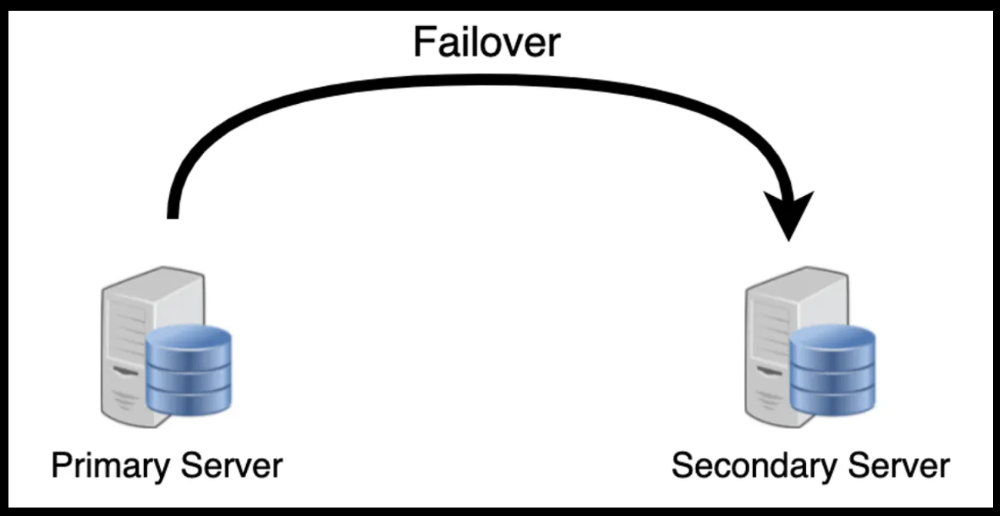
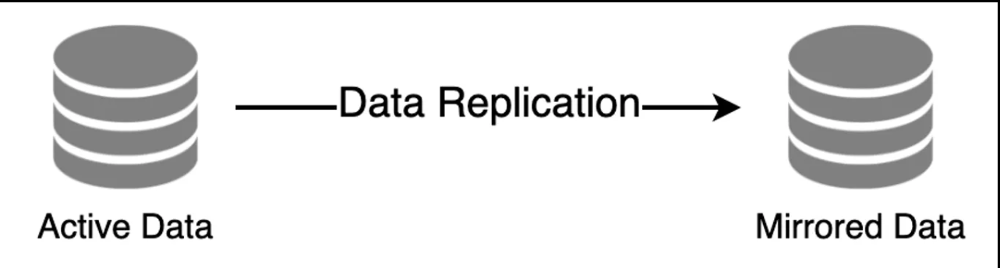
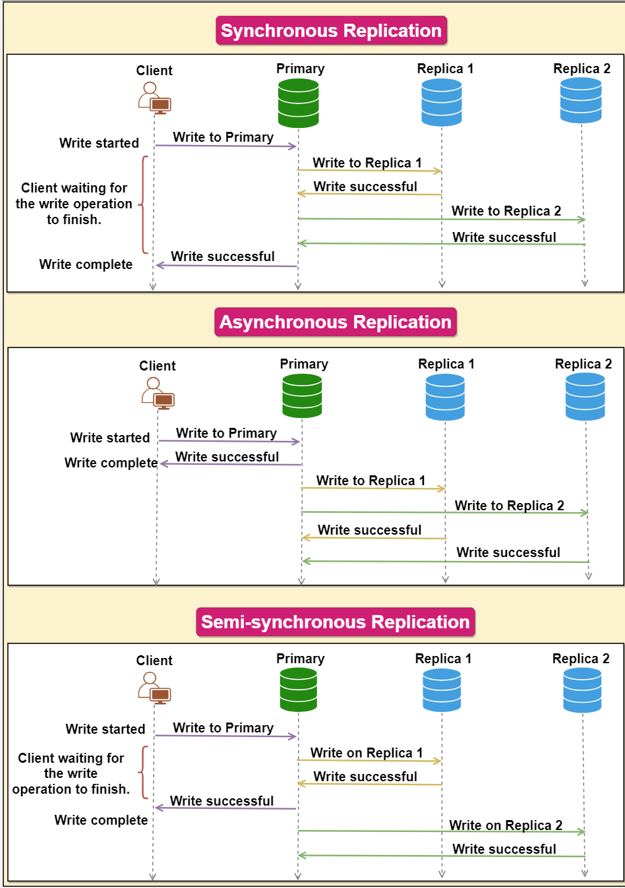

# What is Redundancy?
Redundancy refers to the **duplication of critical components or functions to increase the reliability, availability, and fault tolerance of a system**. The primary purpose of redundancy is to **prevent system failures and ensure continuous operation**, even in the event of hardware, software, or network issues. Redundant systems are designed to **maintain functionality and performance despite component failures**, providing increased resilience against downtime and data loss.

Redundancy plays a key role in **removing the single points of failure in the system** and provides backups if needed in a crisis. For example, if we have two instances of a service running in production and one fails, the system can **failover** to the other one.

  

## Benefits of redundancy in system design
Implementing redundancy in system design offers numerous advantages:

### 1. Improved reliability
Redundant systems are more reliable, as they can continue to function despite individual component failures. This increased reliability reduces the likelihood of system outages, ensuring the availability of critical services and applications.

### 2. Enhanced fault tolerance
By incorporating redundant components, a system can better tolerate and recover from faults or failures. This fault tolerance is essential for maintaining high availability and minimizing downtime, particularly in mission-critical systems.

### 3. Increased availability
Redundant systems are designed to provide continuous operation, ensuring that services and applications remain available even during component failures or maintenance. This increased availability is crucial for organizations that rely on 24/7 access to their systems and data.

### 4. Simplified maintenance
Redundancy allows for maintenance and upgrades to be performed without disrupting system operation. By having backup components in place, administrators can perform maintenance on one part of the system while the redundant components continue to provide service.

### 5. Disaster recovery
Redundancy plays a crucial role in disaster recovery planning. By having multiple, geographically distributed copies of data and resources, organizations can recover more quickly from disasters or catastrophic events that may affect a single location.

## Conclusion
Overall, implementing redundancy in system design is essential for ensuring the reliability, availability, and fault tolerance of modern computing systems. It helps prevent downtime, data loss, and other issues that can negatively impact user experience, productivity, and business operations.

# What is Replication?
Database replication is the **process of copying and synchronizing data from one database to one or more additional databases**. This is commonly used in distributed systems where multiple copies of the same data are required to ensure data availability, fault tolerance, and scalability.

Replication is widely used in many **database management systems** (DBMS), usually with a primary-replica relationship between the original and the copies. The primary server gets all the updates, which then ripple through to the replica servers. Each replica outputs a message stating that it has received the update successfully, thus allowing the sending of subsequent updates.

  

## Redundancy vs. Replication: Key Differences
1. Active vs. Passive:

- Redundancy is often passive – the backup components are there in case of failure but are not actively used in normal operations.
-Replication is active – all copies of the data are usually utilized in some way, either for load balancing or data recovery.

2. Focus:

- Redundancy focuses on the **reliability and availability** of the overall system.
- Replication focuses on the **availability and integrity** of the data.

3. Implementation:

- Redundancy might involve **identical backup systems or components**.
- Replication involves **distributing and synchronizing data across different systems**.

In essence, while both redundancy and replication are about ensuring high availability and system reliability, **redundancy is more about having backup resources at the ready**, and replication is about **keeping multiple active copies of data**. In distributed systems, using both strategies can significantly enhance performance and reliability.

## Replication Strategies

1. Synchronous replication
Synchronous replication is a type of database replication where changes made to the primary database are immediately replicated to the replica databases before the write operation is considered complete. In other words, the primary database waits for the replica databases to confirm that they have received and processed the changes before the write operation is acknowledged.

In synchronous replication, there is a strong consistency between the primary and replica databases, as all changes made to the primary database are immediately reflected in the replica databases. This ensures that the data is consistent across all databases and reduces the risk of data loss or inconsistency.

2. Asynchronous replication
Asynchronous replication is a type of database replication where changes made to the primary database are not immediately replicated to the replica databases. Instead, the changes are queued and replicated to the replicas at a later time.

In asynchronous replication, there is a delay between the write operation on the primary database and the update on the replica databases. This delay can result in temporary inconsistencies between the primary and replica databases, as the data on the replica databases may not immediately reflect the changes made to the primary database.

However, asynchronous replication can also have performance benefits, as write operations can be completed quickly without waiting for confirmation from the replica databases. In addition, if one or more replica databases are unavailable, the write operation can still be completed on the primary database, ensuring that the system remains available.

3. Semi-synchronous replication
Semi-synchronous replication is a type of database replication that combines elements of both synchronous and asynchronous replication. In semi-synchronous replication, changes made to the primary database are immediately replicated to at least one replica database, while other replicas may be updated asynchronously.

In semi-synchronous replication, the write operation on the primary is not considered complete until at least one replica database has confirmed that it has received and processed the changes. This ensures that there is some level of strong consistency between the primary and replica databases, while also providing improved performance compared to fully synchronous replication

  

# Replication Methods
Replication in database systems is a strategy for **ensuring data availability, redundancy, and load balancing**. There are several replication methods, each with its advantages and challenges.

## 1. Primary-Replica (Master-Slave) Replication
### Explanation
In primary-replica replication, there is one primary (master) database and one or more replica (slave) databases. The primary database handles all write operations, while the replicas handle read operations. Changes made in the primary database are **asynchronously replicated to the replica databases**.

### Example
A web application uses a primary database for all data insertions and updates. It replicates this data to multiple replica databases, which are then used to handle user queries, reducing the load on the primary database.

### Pros
- Data Redundancy: Provides data redundancy and enhances data availability.
- Load Balancing: Allows for load balancing by distributing read queries across multiple replicas.
- Simplicity: Generally simpler to implement and manage than primary-primary replication.

### Cons
- Write Bottleneck: The primary database can become a bottleneck for write operations.
- Replication Lag: Changes in the primary may take some time to propagate to the replicas, leading to potential data inconsistency.

## 2. Primary-Primary (Master-Master) Replication
### Explanation
In primary-primary replication, **two or more database nodes act as primary nodes**. Each node can handle both read and write operations. Data written to one node is replicated to the other node(s), allowing each node to have an up-to-date copy of the database.

### Example
In a distributed e-commerce platform, two database servers in different geographical locations both handle user transactions. This setup ensures that if one server goes down, the other can continue to operate, providing both write and read capabilities.

### Pros
- High Availability: Enhances availability since write operations can be handled by multiple nodes.
- Load Distribution: Distributes write load across multiple servers.
- No Single Point of Failure: Reduces the risk of a single point of failure for write operations.

### Cons
- Conflict Resolution: Requires a mechanism to handle conflicts when the same data is written to multiple nodes simultaneously.
- Complexity: More complex to implement and manage than primary-replica replication.
- Overhead: Additional overhead for synchronizing data between primary nodes.

## 3. Multi-Master Replication
### Explanation
- **Similar** to primary-primary replication, but **involves more than two nodes, all capable of handling write operations**.
- Changes in any node are replicated across all other nodes.

### Pros
- Increases write availability and resilience.
- Useful in distributed systems for geographic redundancy.

### Cons
- Complexity increases significantly, especially in conflict resolution.
Synchronization overhead can impact performance.

## 4. Read-Replica Replication
### Explanation
- A variation of primary-replica replication where the replicas are specifically used for read-only operations.
- Often used in cloud databases for scaling out read operations.

### Pros
- Improves read performance by distributing read load.
- Straightforward setup and low impact on the primary node.

### Cons
Does not improve write capacity.
Potential replication lag can lead to slightly stale data on replicas.

## 5. Snapshot Replication
### Explanation
- Involves replicating data as it **appeared at a specific moment in time**.
- Often used for replicating databases to a data warehouse for reporting.

### Pros
- Simple to understand and implement.
- Useful for offloading complex queries from the operational database.

### Cons
Not suitable for applications requiring up-to-date, real-time data.
Can be resource-intensive, depending on the size of the snapshot.

## 6. Hybrid Replication
### Explanation
Combines different replication methods to meet specific requirements.
For example, using multi-master replication between two data centers and read-replica replication within each data center.

### Pros
- Flexibility to tailor replication strategy to specific needs.
- Can optimize for both performance and data consistency.

### Cons
- Increased complexity in configuration and management.
- Potential for conflicting replication behaviors if not properly coordinated.

## Conclusion
Primary-replica replication is suitable for scenarios where read operations heavily outweigh writes, and simplicity and ease of management are priorities. On the other hand, primary-primary replication is more suited for systems requiring high availability and resilience, where writes need to be distributed across multiple nodes. However, it comes with increased complexity and the need for effective conflict resolution mechanisms. Choosing the right replication strategy depends on the specific requirements and constraints of the system.

# Data Backup vs. Disaster Recovery
Data Backup and Disaster Recovery are critical components in an organization's data management and IT infrastructure strategy. While they are related and often used together for data protection, they serve different purposes and have distinct operational focuses.

## Data Backup
### Definition
Data Backup refers to the **process of creating copies of data to be used in case the original data is lost or damaged**. **The primary goal is to restore data after events like deletion, corruption, or minor hardware failures**.

### Characteristics
- Data Copies: Involves copying and archiving data for future restoration.
- Frequency: Can be scheduled at regular intervals (daily, weekly, etc.).
- Scope: Typically includes important files, databases, application data, etc.
- Storage: Backups are stored on tapes, disks, or cloud storage.

### Use Cases
- Restoring accidentally deleted files.
- Recovering data from corrupted databases.
- Retrieving previous versions of data.

### Example
An organization regularly backs up its database to a cloud storage service. An employee accidentally deletes a critical file, which is then restored from the most recent backup.

## Disaster Recovery
### Definition
Disaster Recovery is a broader strategy that includes policies, tools, and procedures for protecting and restoring an organization's IT infrastructure in the event of a major disaster, such as a natural disaster, cyberattack, or major hardware failure.

### Characteristics
- Comprehensive Planning: Includes plans for quickly re-establishing access to applications, data, and IT resources.
- Business Continuity: Focuses on maintaining or quickly resuming mission-critical functions.
- Infrastructure Recovery: Involves restoring entire servers, networks, and other critical infrastructure.
- Testing and Documentation: Requires regular testing and clear documentation for effective implementation.

### Use Cases
Reactivating IT operations after a major cyberattack like ransomware.
Resuming business operations at an alternate location after a natural disaster damages the primary data center.

### Example
After a flood damages a company's primary data center, their operations are shifted to a secondary location where they can access their IT resources and maintain business continuity.

## Key Differences
### Purpose:

- Data Backup: Primarily focused on **data preservation and restoration**.
- Disaster Recovery: A **comprehensive approach to resuming business operations after catastrophic events**.

### Scope:

- Data Backup: Involves **duplicating data**.
- Disaster Recovery: Encompasses **restoring entire systems and infrastructure**.

### Objective:

- Data Backup: To **protect against data loss and ensure data retrieval**.
- Disaster Recovery: To **ensure business continuity and minimize downtime in the event of major disruptions**.

### Scale of Incident:

- Data Backup: Typically **addresses smaller-scale data loss incidents**.
- Disaster Recovery: **Deals with large-scale disruptions affecting entire IT systems**.

### Complexity and Planning:

- Data Backup: Relatively simpler; involves regular copying of data.
- Disaster Recovery: More complex; requires extensive planning and testing.

## Conclusion
While data backup is an essential component of disaster recovery, it is just one part of a comprehensive disaster recovery plan. Data backup is about protecting and restoring data, whereas disaster recovery is about maintaining or quickly resuming critical business operations during and after major incidents. An effective IT strategy incorporates both elements to ensure data protection and business resilience.