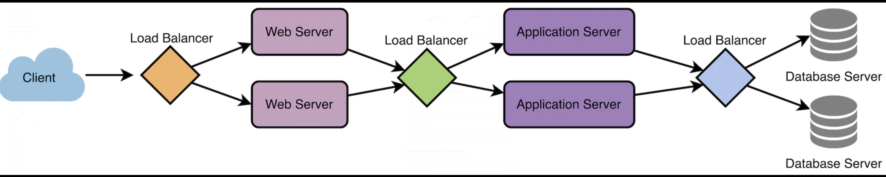
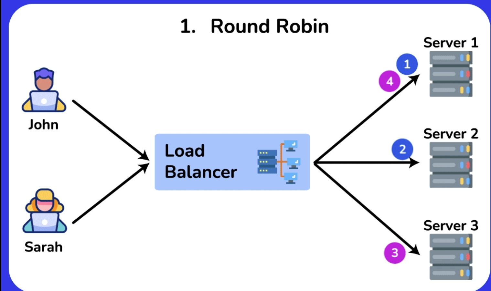
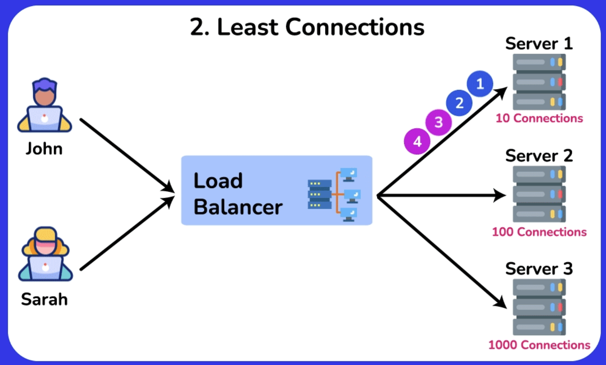
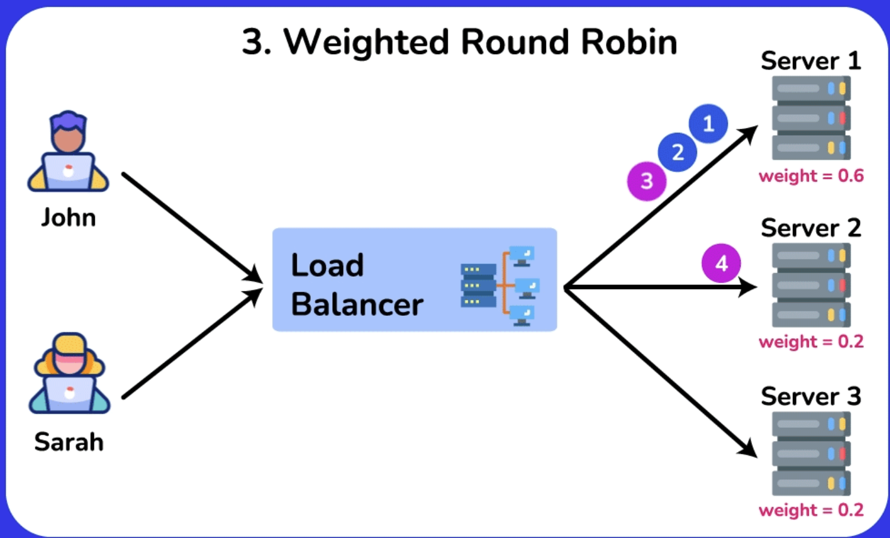
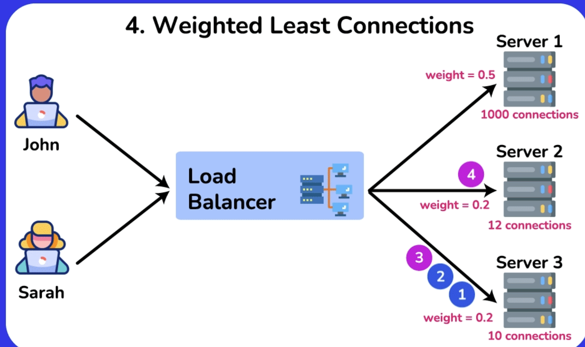
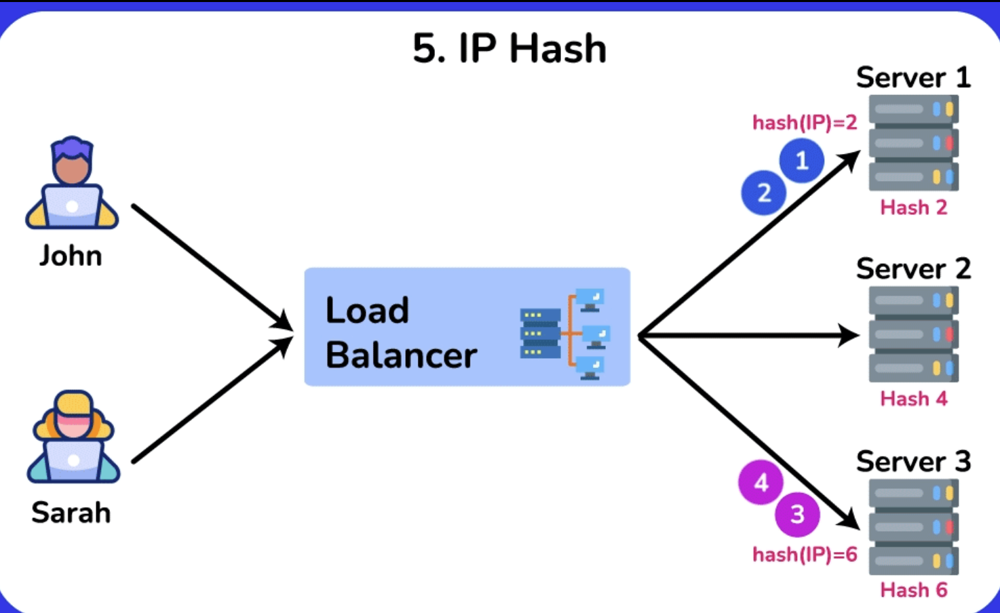
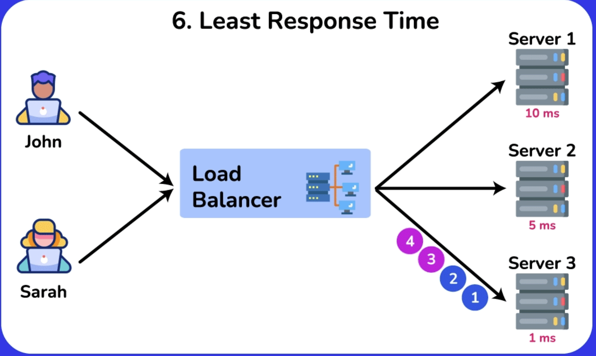
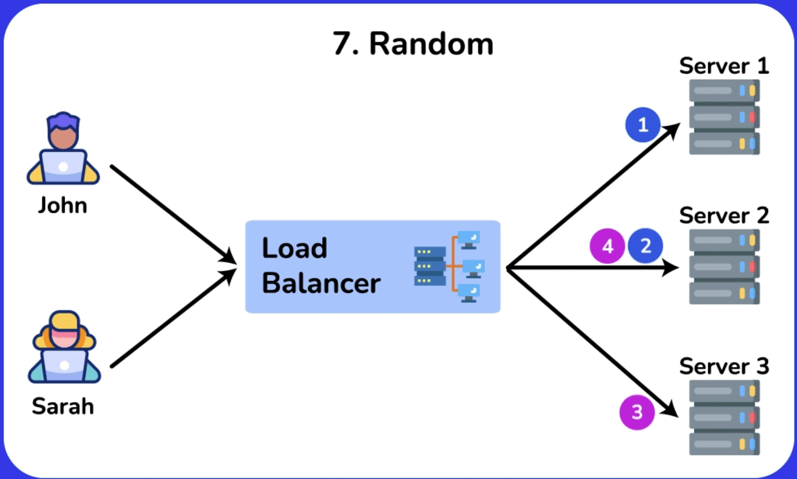
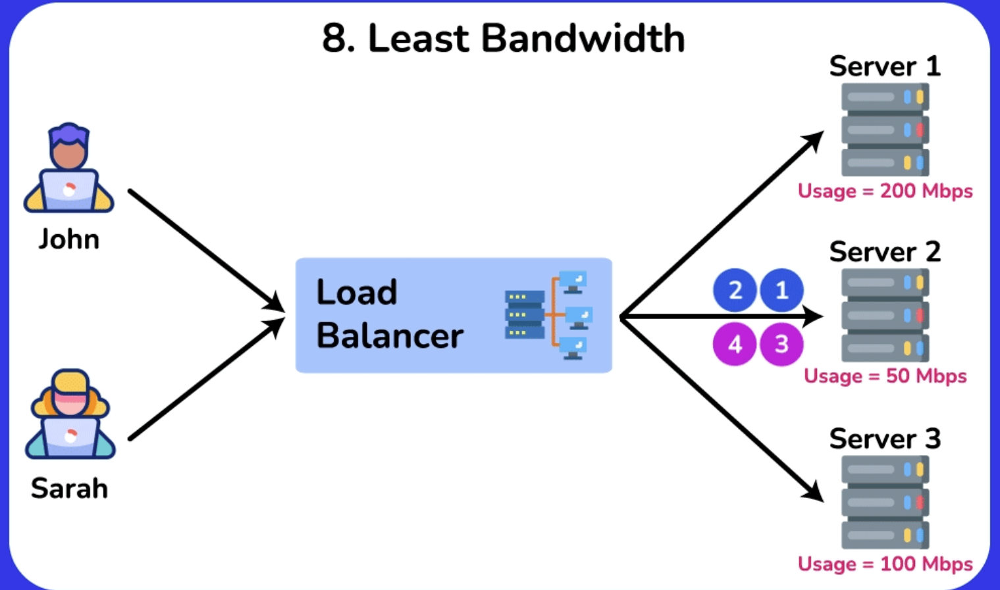

# Introduction to Load Balancing

Load balancing is a **crucial component** of *System Design*, as it helps **distribute incoming requests** and **traffic** evenly across **multiple servers**. The **main goal** of load balancing is to **ensure high availability**, **reliability**, and **performance** by *avoiding* **overloading** a single server and *avoiding* **downtime**.

Typically a load balancer sits between the client and the server accepting incoming network and application traffic and distributing the traffic across multiple backend servers using various algorithms. By balancing application requests across multiple servers, a load balancer **reduces the load on individual servers** and **prevents any one server from becoming a single point of failure**, thus *improving* overall application **availability** and **responsiveness**.

To *utilize* **full scalability** and **redundancy**, we can try to balance the load at **each layer of the system**. We can add LBs at **three places**:

1. Between the *user* and the *web server*
2. Between *web servers* and an *internal platform layer*, like **application servers** or **cache servers**
3. Between *internal platform layer* and *database*.

  

## Key terminology and concepts
1. **Load Balancer**: A *device* or *software* that **distributes network traffic** across **multiple servers** based on **predefined rules or algorithms**
2. **Backend Servers**: The servers that **receive** and **process** requests **forwarded** by the *load balancer*. Also referred to as *server pool* or *server fam*
3. **Load Balancing Algorithm**: The **method** used by the load balancer to **determine how to distribute incoming traffic** among the backend servers.
4. **Health Checks**: **Periodic tests** performed by the *load balancer* to **determine the availability** and **performance** of backend servers. *Unhealthy servers* are **removed** from the server pool **until they recover**.
5. **Session Persistence**: A technique **used to ensure that subsequent requests from the same client are directed to the same backend server**, maintaining session state and providing a consistent user experience.
6. **SSL/TLS Termination**: The *process* of **decrypting SSL/TLS-encrypted traffic at the load balancer level**, **offloading** the *decryption burden* from *backend servers* and allowing for **centralized SSL/TLS management**.

## How Load Balancer works?
Load balancers work by **distributing incoming network traffic** across multiple servers or resources to **ensure efficient utilization** of *computing resources* and *prevent overload*. Here are the **general steps** that a load balancer follows to distribute traffic:

1. The load balancer **receives a request** from a *client* or *user*.
2. The load balancer **evaluates the incoming request** and determines which server or resource should handle the request. This is done based on a **predefined load-balancing algorithm** that takes into account factors such as **server capacity**, **server response time**, **number of active connections**, and **geographic location**.
3. The load balancer **forwards the incoming traffic** to the *selected server* or *resource*.
4. The server or resource **processes the request** and sends a **response back** to the load balancer.
5. The load balancer **receives the response** from the server or resource and sends it to the *client* or *user* who made the request.

# Load Balancing Algorithms
A **load balancing algorithm** is a *method* used by a load balancer to distribute incoming traffic and requests among multiple servers or resources. The **primary purpose** of a load balancing algorithm is to **ensure efficient utilization** of available resources, improve overall **system performance**, and maintain **high availability** and **reliability**.

Load balancing algorithms help to **prevent any single server or resource from becoming overwhelmed**, which could lead to **performance degradation** or **failure**. By distributing the workload, load balancing algorithms can **optimize response times**, **maximize throughput**, and **enhance user experience**. These algorithms can consider factors such as **server capacity**, **active connections**, **response times**, and **server health**, among others, to make informed decisions on how to best distribute incoming requests.

Here are the most famous load balancing algorithms:

## 1. Round Robin
This algorithm distributes incoming requests to servers in a **cyclic order**. It assigns a request to the first server, then moves to the second, third, and so on, and after reaching the **last server**, it **starts again at the first**.

### Pros:

- Ensures an **equal distribution** of requests among the servers, as each server **gets a turn in a fixed order**.
- Easy to implement and understand.
- Works well when servers have similar capacities.

### Cons:

- **No Load Awareness**: **Does not** take into account the **current load** or **capacity** of each server. All servers are **treated equally** regardless of their current state.
- **No Session Affinity**: Subsequent requests from the **same client** may be directed to **different servers**, which can be problematic for stateful applications.
- **Performance Issues with Different Capacities**: May not perform optimally when servers have **different capacities** or **varying workloads**.
- **Predictable Distribution Pattern**: Round Robin is **predictable** in its **request distribution pattern**, which **could potentially** be *exploited* by attackers who can observe traffic patterns and might find vulnerabilities in specific servers by predicting which server will handle their requests.

### Use Cases
- **Homogeneous Environments**: Suitable for environments where all servers have **similar capacity and performance**.
- **Stateless Applications**: Works well for *stateless applications* where each **request** can be **handled independently**.

  

## 2. Least Connections

The *Least Connections algorithm* is a **dynamic load balancing technique** that assigns incoming requests to the server with the **fewest active connections** at the time of the request. This method ensures a more balanced distribution of load across servers, especially in environments where traffic patterns are unpredictable and request processing times vary.

### Pros:

- **Load Awareness**: Takes into account the current load on each server by considering the **number of active connections**, leading to **better utilization** of server resources.
- **Dynamic Distribution**: **Adapts to changing traffic patterns** and **server loads**, **ensuring** no single server becomes a **bottleneck**.
- **Efficiency in Heterogeneous Environments**: Performs well when **servers have varying capacities** and **workloads**, as it **dynamically** allocates requests to **less busy servers**.

### Cons:

- **Higher Complexity**: More complex to implement compared to simpler algorithms like Round Robin, as it **requires real-time monitoring** of **active connections**.
- **State Maintenance**: Requires the load balancer to **maintain the state of active connections**, which can increase overhead.
- **Potential for Connection Spikes**: In scenarios where connection duration is short, servers can experience rapid spikes in connection counts, leading to frequent rebalancing.

### Use Cases
- **Heterogeneous Environments**: Suitable for environments where servers have **different capacities** and **workloads**, and the load needs to be dynamically distributed.
- **Variable Traffic Patterns**: Works well for applications with **unpredictable** or **highly variable traffic patterns**, ensuring that no single server is overwhelmed.
- **Stateful Applications**: Effective for applications where maintaining session state is important, as it helps distribute active sessions more evenly.

### Comparison to Round Robin
- **Round Robin**: Distributes requests in a **fixed**, **cyclic order** without considering the current load on each server.
- **Least Connections**: Distributes requests based on the **current load**, directing new requests to the server with the **fewest active connections**.

  

## 3. Weighted Round Robin

*Weighted Round Robin* (WRR) is an enhanced version of the Round Robin load balancing algorithm. It **assigns weights** to **each server** based on their **capacity** or **performance**, distributing incoming requests **proportionally according to these weights**. This ensures that **more powerful servers** handle a **larger share of the load**, while **less powerful servers** handle a **smaller share**.

### Pros
- **Load Distribution According to Capacity**: Servers with higher capacities **handle more requests**, leading to **better utilization** of resources.
- **Flexibility**: Easily adjustable to accommodate changes in server capacities or additions of new servers.
- **Improved Performance**: Helps in **optimizing** overall system performance by **preventing overloading** of **less powerful servers**.

### Cons
- **Complexity in Weight Assignment**: **Determining appropriate weights** for each server can be **challenging** and requires **accurate performance metrics**.
- **Increased Overhead**: Managing and updating weights can introduce **additional overhead**, especially in **dynamic environments** where server performance fluctuates.
- **Not Ideal for Highly Variable Loads**: In environments with highly variable load patterns, WRR may not always provide optimal load balancing as it **doesn't consider real-time server load**.

### Use Cases
- **Heterogeneous Server Environments**: Ideal for environments where servers have **different processing capabilities**, ensuring efficient use of resources.
- **Scalable Web Applications**: Suitable for web applications where **different servers** may have **varying performance characteristics**.
- **Database Clusters**: Useful in database clusters where some nodes have **higher processing power** and can handle more queries

  

## 4. Weighted Least Connections
*Weighted Least Connections* is an **advanced load balancing algorithm** that combines the principles of the **Least Connections** and **Weighted Round Robin algorithms**. It takes into account both the **current load** (*number of active connections*) on each server and the **relative capacity of each server** (*weight*). This approach ensures that **more powerful servers** handle a **proportionally larger share of the load**, while also dynamically adjusting to the real-time load on each server.

### Pros
- **Dynamic Load Balancing**: Adjusts to the **real-time load** on each server, ensuring a more balanced distribution of requests.
- **Capacity Awareness**: Takes into account the **relative capacity of each server**, leading to **better utilization** of resources.
- **Flexibility**: Can handle environments with heterogeneous servers and variable load patterns effectively.

### Cons
- **Complexity**: **More complex** to implement compared to simpler algorithms like Round Robin and Least Connections.
- **State Maintenance**: Requires the load balancer to **keep track** of **both active connections** and **server weights**, increasing **overhead**.
- **Weight Assignment**: Determining appropriate weights for each server can be **challenging** and requires **accurate performance metrics**.

### Use Cases
- **Heterogeneous Server Environments**: Ideal for environments where servers have different processing capacities and workloads.
- **High Traffic Web Applications**: Suitable for web applications with **variable traffic patterns**, ensuring no single server becomes a bottleneck.
- **Database Clusters**: Useful in database clusters where nodes have varying performance capabilities and query loads.

  

## 5. IP Hash
IP Hash load balancing is a *technique* that assigns client requests to servers **based on the client's IP address**. The load balancer uses a **hash function** to **convert** the **client's IP address into a hash value**, which is then **used to determine** which *server* **should handle the request**. This method **ensures** that **requests from the same client IP address are consistently routed** to the *same server*, providing **session persistence**.

### Example
Suppose you have three servers (Server A, Server B, and Server C) and a client with the IP address 192.168.1.10. The load balancer applies a hash function to this IP address, resulting in a hash value. If the hash value is 2 and there are three servers, the load balancer routes the request to Server C (2 % 3 = 2).

### Pros
- **Session Persistence**: Ensures that **requests from the same client IP address** are consistently **routed to the same server**, which is beneficial for stateful applications.
- **Simplicity**: Easy to implement and **does not require** the load balancer to maintain the **state of connections**.
- **Deterministic**: **Predictable and consistent** routing based on the **client's IP address**.

### Cons
- **Uneven Distribution**: If client IP addresses are not **evenly distributed**, some servers **may receive more requests** than others, leading to an **uneven load**.
- **Dynamic Changes**: **Adding** or **removing** servers can **disrupt the hash mapping**, causing some clients to be routed to different servers.
- **Limited Flexibility**: **Does not take into account** the **current load** or **capacity** of servers, which can lead to **inefficiencies**.

### Use Cases
- **Stateful Applications**: Ideal for *applications* where **maintaining session persistence is important**, such as online shopping carts or user sessions.
- **Geographically Distributed Clients**: Useful when clients are **distributed across different regions** and **consistent routing** is required.

  

## 6. Least Response Time
Least Response Time load balancing is a **dynamic algorithm** that **assigns incoming requests to the server** with the **lowest response time**, ensuring efficient utilization of server resources and optimal client experience. This approach aims to **direct traffic** to the server that **can handle the request the fastest**, based on **recent performance metrics**.

### How Least Response Time Load Balancing Works
- **Monitor Response Times**: The load balancer **continuously monitors** the **response times of each server**. Response time is typically measured from when a request is sent to a server until a response is received.
- **Assign Requests**: When a new request arrives, the load balancer **assigns it** to the server **with the lowest average response time**.
- **Dynamic Adjustment**: The load balancer dynamically adjusts the assignment of requests **based on real-time performance data**, ensuring that the fastest server handles the next request.

### Pros
- **Optimized Performance**: Ensures that requests are handled by the **fastest available server**, leading to **reduced latency** and **improved client experience**.
- **Dynamic Load Balancing**: **Continuously adjusts** to **changing server performance**, ensuring optimal distribution of load.
- **Effective Resource Utilization**: Helps in **better utilization** of server resources by directing traffic to servers that can respond quickly.

### Cons
- **Complexity**: **More complex** to implement compared to simpler algorithms like Round Robin, as it **requires continuous monitoring** of server performance.
- **Overhead**: Monitoring response times and dynamically adjusting the load can introduce **additional overhead**.
- **Short-Term Variability**: Response times can vary in the short term due to network fluctuations or transient server issues, potentially causing frequent rebalancing.

### Use Cases
- **Real-Time Applications**: Ideal for applications where **low latency** and **fast response times** are critical, such as online gaming, video streaming, or financial trading platforms.
- **Web Services**: Useful for web services and APIs that need to provide **quick responses** to **user requests**.
- **Dynamic Environments**: Suitable for environments with **fluctuating loads** and **varying server performance**.

  

## 7. Random
Random load balancing is a simple algorithm that distributes incoming requests to servers **randomly**. Instead of following a fixed sequence or using performance metrics, the load balancer selects a server at random to handle each request. This method can be effective in scenarios where the **load** is **relatively uniform** and **servers have similar capacities**.

Suppose you have three servers: Server A, Server B, and Server C. When a new request arrives, the load balancer randomly chooses one of these servers to handle the request. Over time, if the randomness is uniform, each server should receive approximately the same number of requests.

### Pros
- **Simplicity**: Very easy to implement and understand, requiring **minimal configuration**.
- **No State Maintenance**: The load balancer **does not** need to *track* the **state or performance of servers**, reducing overhead.
- **Uniform Distribution Over Time**: **If the random selection is uniform**, the load will be evenly distributed across servers over a long period.

### Cons
- **No Load Awareness**: **Does not consider** the **current load** or **capacity** of servers, which can lead to uneven distribution if server performance varies.
- **Potential for Imbalance**: In the short term, random selection can lead to an uneven distribution of requests.
- **No Session Affinity**: Requests from the same client may be directed to **different servers**, which can be **problematic for stateful applications**.
- **Security systems** that rely on detecting anomalies (e.g., to mitigate DDoS attacks) might find it slightly more challenging to identify malicious patterns **if a Random algorithm is used**, due to the **inherent unpredictability in request distribution**. This could potentially dilute the visibility of attack patterns.

### Use Cases
- **Homogeneous Environments**: Suitable for environments where servers have **similar capacity** and **performance**.
- **Stateless Applications**: Works well for stateless applications where each request can be **handled independently**.
- **Simple Deployments**: Ideal for simple deployments where the complexity of other load balancing algorithms is not justified.

  

## 8. Least Bandwidth
The Least Bandwidth load balancing algorithm **distributes incoming requests** to servers **based on the current bandwidth usage**. It routes each new request to the server that is **consuming the least amount of bandwidth at the time**. This approach helps in balancing the network load more efficiently by ensuring that no single server gets overwhelmed with too much data traffic.

### Pros
- **Dynamic Load Balancing**: Continuously adjusts to the current network load, ensuring optimal distribution of traffic.
- **Prevents Overloading**: Helps in preventing any single server from being overwhelmed with too much data traffic, leading to better performance and stability.
- **Efficient Resource Utilization**: Ensures that all servers are utilized more effectively by balancing the bandwidth usage.

### Cons
- **Complexity**: **More complex** to implement compared to simpler algorithms like Round Robin, as it requires continuous **monitoring of bandwidth usage**.
- **Overhead**: **Monitoring bandwidth** and **dynamically adjusting** the load can introduce **additional overhead**.
- **Short-Term Variability**: Bandwidth usage can fluctuate in the short term, potentially causing frequent rebalancing.

### Use Cases
- **High Bandwidth Applications**: Ideal for applications with **high bandwidth usage**, such as **video streaming**, **file downloads**, and **large data transfers**.
- **Content Delivery Networks (CDNs)**: Useful for CDNs that need to balance traffic efficiently to deliver content quickly.
- **Real-Time Applications**: Suitable for real-time applications where **maintaining low latency** is **critical**.

  

## 9. Custom Load
Custom Load load balancing is a **flexible** and **highly configurable** approach that allows you to **define your own metrics** and **rules** for distributing incoming traffic across a pool of servers. Unlike standard load balancing algorithms that use predefined criteria such as connection count or response time, Custom Load load balancing enables you to tailor the distribution strategy based on specific requirements and **conditions unique to your application or infrastructure**.

### How Custom Load Load Balancing Works
- **Define Custom Metrics**: Determine the metrics that best represent the load or performance characteristics relevant to your application. These metrics can include **CPU usage**, **memory usage**, **disk I/O**, **application-specific metrics**, or a **combination of several metrics**.

- **Implement Monitoring**: **Continuously monitor** the **defined metrics** on each server in the pool. This may involve integrating with monitoring tools or custom scripts that collect and report the necessary data.

- **Create Load Balancing Rules**: **Establish rules** and **algorithms** that use the monitored metrics to make load balancing decisions. This can be a simple weighted sum of metrics or more complex logic that prioritizes certain metrics over others.

- **Dynamic Adjustment**: Use the collected data and rules to **dynamically adjust** the distribution of incoming requests, ensuring that the traffic is balanced according to the custom load criteria.

### Pros
- **Flexibility**: Allows for **highly customized load balancing strategies** tailored to the **specific needs and performance characteristics** of your application.
- **Optimized Resource Utilization**: Can lead to **more efficient** use of server resources by considering a comprehensive set of metrics.
- **Adaptability**: Easily adaptable to changing conditions and requirements, making it suitable for complex and dynamic environments.

### Cons
- **Complexity**: **More complex** to implement and configure compared to standard load balancing algorithms.
- **Monitoring Overhead**: Requires continuous monitoring of multiple metrics, which can introduce additional overhead.
- **Potential for Misconfiguration**: Incorrectly defined metrics or rules can lead to suboptimal load balancing and performance issues.

### Use Cases
- **Complex Applications**: Ideal for applications with **complex performance characteristics** and **varying resource requirements**.
- **Highly Dynamic Environments**: Suitable for environments where workloads and server performance can **change rapidly** and **unpredictably**.
- **Custom Requirements**: Useful when standard load balancing algorithms do not meet the specific needs of the application.

# Uses of Load Balancing

Load balancing is a *technique* used to distribute workloads evenly across multiple computing resources, such as servers, network links, or other devices, in order to **optimize resource utilization**, **minimize response time**, and **maximize throughput**. This technique helps **ensure** that **no single resource is overwhelmed**, thus maintaining a *high level* of **performance** and **reliability**. Here are some common uses of load balancing:

## 1. Improving website performance
Load balancing can distribute incoming web traffic among multiple servers, **reducing the load** on individual servers and ensuring faster response times for end users.

- Example: An e-commerce website experiences a sudden surge in traffic during a holiday sale. A load balancer distributes incoming requests among multiple web servers, ensuring that each server handles a manageable number of requests, resulting in **faster page load times** for users

## 2. Ensuring high availability and reliability
By distributing the workload among multiple servers, load balancing helps **prevent single points of failure**. If one server fails or experiences an issue, the load balancer can redirect traffic to other available servers, **maintaining uptime** and **minimizing service disruptions**.

- Example: A banking application relies on several servers to handle user transactions. The load balancer monitors the health of each server and, in the event of a server failure, redirects traffic to the remaining healthy servers, minimizing downtime and maintaining user access to the application.

## 3. Scalability
Load balancing **allows organizations to easily scale** their infrastructure as traffic and demand increase. **Additional servers can be added to the load balancing pool** to accommodate increased demand, without the need for significant infrastructure changes.

- Example: A video streaming platform sees a steady increase in users as it gains popularity. To handle the growing demand, the platform **adds new servers to the load balancing pool**, allowing it to scale seamlessly without overloading existing infrastructure.

## 4. Redundancy
Load balancing can be used to **maintain redundant copies of data** and **services** across multiple servers, **reducing the risk of data loss** or **service outages** due to hardware failure or other issues.

- Example: An online file storage service uses load balancing to maintain multiple copies of user data across different servers. If one server experiences a hardware failure, users can still access their data from the redundant copies stored on other servers.

## 5. Network optimization
Load balancing can help **optimize network traffic** by distributing it across multiple paths or links, **reducing congestion** and **improving overall network performance**.

- Example: A large organization has multiple internet connections to handle its network traffic. A load balancer distributes the incoming and outgoing traffic across these connections, reducing congestion and improving overall network performance.

## 6. Geographic distribution
For global organizations, load balancing can be used to distribute traffic across data centers in **different geographic locations**. This ensures that users are directed to the nearest or best-performing data center, reducing latency and improving user experience.

- Example: A multinational company has data centers in North America, Europe, and Asia. A load balancer directs users to the nearest data center **based on their geographic location**, reducing latency and improving the user experience.

## 7. Application performance
Load balancing can be used to distribute requests for specific applications or services among dedicated servers or resources, ensuring that each application or service **receives the necessary resources to perform optimally**.

- Example: An enterprise uses a suite of applications, including email, file storage, and collaboration tools. A load balancer assigns dedicated resources to each application, ensuring that each service performs optimally without affecting the performance of other applications.

## 8. Security
Load balancers **can help protect against distributed denial-of-service** (*DDoS*) attacks by distributing incoming traffic across multiple servers, making it **more difficult for attackers to overwhelm a single target**.

- Example: A news website faces a distributed denial-of-service (DDoS) attack, with a large number of malicious requests targeting its servers. The load balancer distributes the traffic among multiple servers, making it more difficult for the attackers to overwhelm a single target and mitigating the impact of the attack.

## 9. Cost savings
By distributing workloads across available resources more efficiently, load balancing can **help organizations save money on hardware and infrastructure costs**, as well as **reduce energy consumption**.

- Example: A small business utilizes cloud-based infrastructure for its web applications. By using load balancing to optimize resource usage, the business can **minimize the number of servers needed**, resulting in **lower infrastructure and energy costs**.

## 10. Content caching
**Some load balancers can cache static content**, such as *images* and *videos*. This cached content is then served directly from the load balancer, reducing the demand on the servers and providing faster response times for users.

- Example: In a streaming service like Netflix, users access a wide variety of content like TV shows, movies, etc. Now, consider a very popular TV show that millions of users might want to watch. If each request for this show was routed to the servers, it would result in a huge load on the servers, potentially slowing down response times or even leading to server failure. By caching such popular content on the load balancer, the streaming service can drastically reduce the load on its main servers.

# Load Balancer Types
A load balancing *type* refers to the *method* or *approach* used to distribute incoming network traffic across multiple servers or resources to ensure efficient utilization, improve overall system performance, and maintain high availability and reliability. **Different load balancing types** are **designed to meet various requirements** and can be implemented using **hardware**, **software**, or **cloud-based solutions**.

Each load balancing type has its **own set of advantages** and **disadvantages**, making it suitable for specific scenarios and use cases. Some common load balancing types include **hardware load balancing**, **software load balancing**, **cloud-based load balancing**, **DNS load balancing**, and **Layer 4** and **Layer 7** load balancing. By understanding the different load balancing types and their characteristics, you can select the most appropriate solution for your specific needs and infrastructure.

## 1. Hardware Load Balancing
Hardware load balancers are physical devices designed specifically for load balancing tasks. They use **specialized hardware components**, such as **Application-Specific Integrated Circuits** (*ASICs*) or **Field-Programmable Gate Arrays** (*FPGAs*), to efficiently distribute network traffic.

### Pros:

- **High performance and throughput**, as they are optimized for load balancing tasks.
- Often include **built-in features** for *network security*, *monitoring*, and *management*.
- Can *handle* **large volumes of traffic** and **multiple protocols**.

### Cons:
- Can be **expensive**, especially for *high-performance models*.
- May **require specialized knowledge** to **configure** and **maintain**.
- **Limited scalability**, as *adding capacity* may **require purchasing additional hardware**.

- Example: A large e-commerce company uses a hardware load balancer to distribute incoming web traffic among multiple web servers, ensuring fast response times and a smooth shopping experience for customers.

## 2. Software Load Balancing
Software load balancers are applications that run on general-purpose servers or virtual machines. They use software algorithms to distribute incoming traffic among multiple servers or resources.

### Pros:
- Generally **more affordable than hardware load balancers**.
- Can be **easily scaled** by **adding more resources** or **upgrading the underlying hardware**.
- **Provides flexibility**, as they can be **deployed on a variety of platforms and environments**, including cloud-based infrastructure.

### Cons:
- May have **lower performance compared to hardware load balancers**, especially under heavy loads.
- **Can consume resources on the host system**, potentially affecting other applications or services.
- May require ongoing software updates and maintenance.

- Example: A startup with a growing user base deploys a software load balancer on a cloud-based virtual machine, distributing incoming requests among multiple application servers to handle increased traffic.

## 3. Cloud-based Load Balancing
**Cloud-based load balancers** are provided as a **service** by **cloud providers**. They offer load balancing capabilities as part of their infrastructure, allowing users to easily distribute traffic among resources within the cloud environment.

### Pros:
- **Highly scalable**, as they can easily accommodate changes in traffic and resource demands.
- **Simplified management**, as the cloud **provider takes care of maintenance, updates, and security**.
- Can be **more cost-effective**, as users **only pay for the resources they use**.

### Cons:

- **Reliance** on the cloud provider for performance, reliability, and security.
- May have **less control over configuration** and **customization** compared to self-managed solutions.
- **Potential vendor lock-in**, as switching to another cloud provider or platform may require significant changes.

- Example: A mobile app developer uses a cloud-based load balancer provided by their cloud provider to distribute incoming API requests among multiple backend servers, ensuring smooth app performance and quick response times.

## 4. DNS Load Balancing
**DNS** (*Domain Name System*) load balancing **relies** on the **DNS infrastructure** to distribute incoming traffic among multiple servers or resources. It works by **resolving a domain name** to **multiple IP addresses**, effectively *directing* **clients to different servers** **based on various policies**.

### Pros:
- **Relatively simple to implement**, as it doesn't require specialized hardware or software.
- Provides basic load balancing and failover capabilities.
- Can distribute traffic **across geographically distributed servers**, improving performance for users in **different regions**.

### Cons:
- **Limited to DNS resolution time**, which can be slow to update when compared to other load balancing techniques.
- No consideration for **server health**, **response time**, or **resource utilization**.
- **May not be suitable** for applications **requiring session persistence or fine-grained load distribution**.

- Example: A content delivery network (CDN) uses DNS load balancing to direct users to the closest edge server based on their geographical location, ensuring faster content delivery and reduced latency.

## 5. Global Server Load Balancing (GSLB)
**Global Server Load Balancing** (*GSLB*) is a technique used to distribute traffic across **geographically dispersed data centers**. It **combines DNS load balancing** with **health checks** and other **advanced features** to provide a more intelligent and efficient traffic distribution method.

### Pros:

- Provides *load balancing* and *failover capabilities* **across multiple data centers** or **geographic locations**.
- Can improve performance and reduce latency for users by directing them to the **closest** or **best-performing** data center.
- Supports advanced features, such as **server health checks**, **session persistence**, and **custom routing policies**.

### Cons:

- Can be **more complex** to set up and manage than other load balancing techniques.
- May require **specialized hardware** or **software**, **increasing costs**.
- Can be subject to the **limitations of DNS**, such as **slow updates** and **caching issues**.

- Example: A multinational corporation uses GSLB to distribute incoming requests for its web applications among several data centers around the world, ensuring high availability and optimal performance for users in different regions.

## 6. Hybrid Load Balancing
Hybrid load balancing **combines the features** and **capabilities of multiple load balancing techniques** to achieve the best possible performance, scalability, and reliability. It typically involves a mix of hardware, software, and cloud-based solutions to provide the most effective and flexible load balancing strategy for a given scenario.

### Pros:

- Offers a **high degree of flexibility**, as it can be tailored to specific requirements and infrastructure.
- Can provide the **best combination of performance**, **scalability**, and **reliability** by leveraging the strengths of different load balancing techniques.
- Allows organizations to adapt and **evolve their load balancing strategy** as **their needs change over time**.

### Cons:

- Can be **more complex to set up**, **configure**, and **manage** than single-technique solutions.
- May **require a higher level of expertise** and understanding of multiple load balancing techniques.
- **Potentially higher costs**, as it may involve a combination of hardware, software, and cloud-based services.

- Example: A large-scale online streaming platform uses a hybrid load balancing strategy, combining hardware load balancers in their data centers for high-performance traffic distribution, cloud-based load balancers for scalable content delivery, and DNS load balancing for global traffic management. This approach ensures optimal performance, scalability, and reliability for their millions of users worldwide.