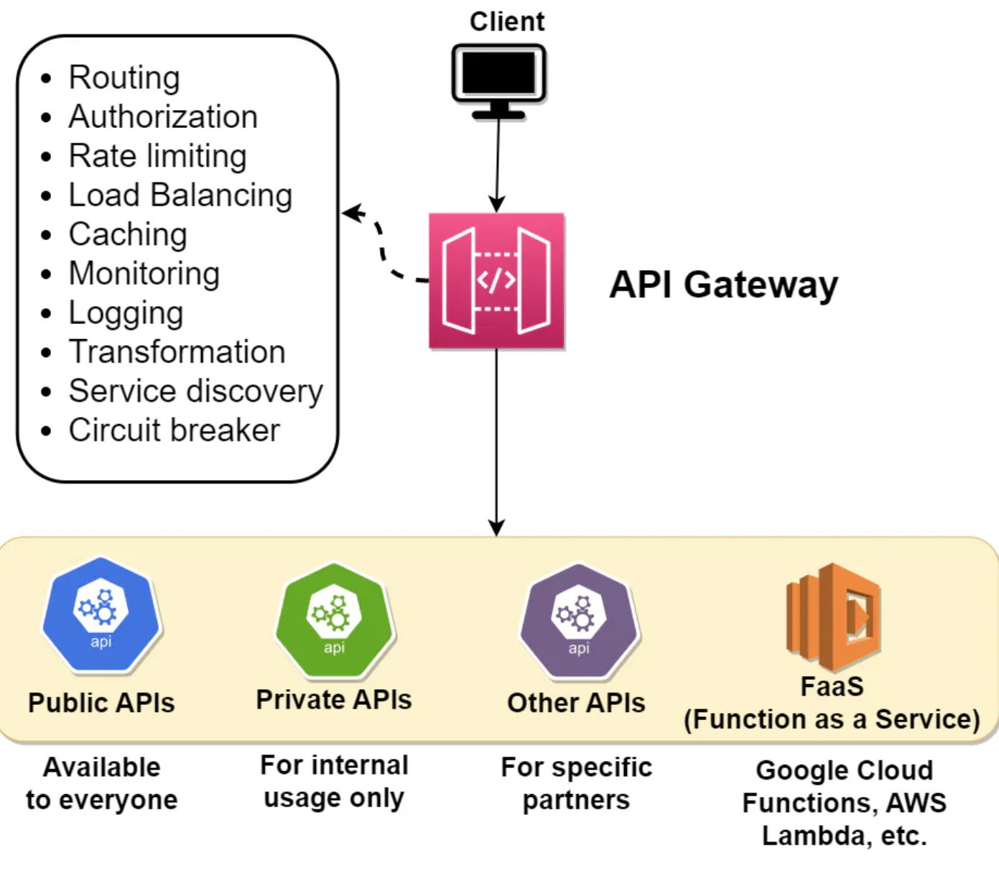

# Introduction to API Gateway
An API Gateway is a **server-side architectural component** in a software system that acts as an **intermediary** between clients (such as web browsers, mobile apps, or other services) and backend services, microservices, or APIs.

Its **main purpose** is to **provide a single entry point for external consumers to access the services and functionalities of the backend system**. It receives client requests, forwards them to the appropriate microservice, and then returns the server’s response to the client.

The API gateway is responsible for tasks such as **routing**, **authentication**, and **rate limiting**. This enables microservices to focus on their individual tasks and improves the overall performance and scalability of the system.

  

## Difference between an API gateway and a load balancer
An API gateway is **focused** on **routing requests to the appropriate microservice**, while a load balancer is **focused on distributing requests evenly across a group of backend servers**.

Another difference between the two is the **type of requests** that they typically handle. An API gateway is typically used to **handle requests for APIs**, which are web-based interfaces that allow applications to interact with each other over the internet. These requests typically have a specific URL that identifies the API that the client is trying to access, and the API gateway routes the request to the appropriate microservice based on this URL. A load balancer, on the other hand, is typically used to **handle requests that are sent to a single, well-known IP address**, and then routes them to one of many possible backend servers based on factors such as server performance and availability.

  

# Usage of API gateway
API gateways are used for a **variety of purposes** in microservice architectures, including the following:

## 1. Routing
The API gateway receives requests from clients and **routes them to the appropriate microservice**. This enables clients to access the various microservices through a single entry point, simplifying the overall system design.

## 2. Rate limiting and throttling
You can rate limit client access to microservices with an API gateway. This **can help prevent denial of service attacks** and other types of **malicious behavior**.

## 3. Caching
The API gateway can **cache responses** from the microservices, reducing the number of requests that need to be forwarded to the microservices and improving the overall performance of the system.

## 4. Authentication and Authorization
The API gateway can be used to **authenticate clients** and **enforce access control policies** for the microservices. This helps to ensure that only authorized clients can access the microservices and helps to prevent unauthorized access.

## 5. Load balancing
The API gateway can **distribute incoming requests among multiple instances** of a microservice, enabling the system to handle a larger number of requests and improving its overall performance and scalability.

## 6. Monitoring
The API gateway can collect metrics and other data about requests and responses, providing valuable insights into the performance and behavior of the microservices. This can **help to identify and diagnose problems, and improve the overall reliability and resilience of the system**.

## 7. Transformation
The API gateway can be used to transform the data received from the microservices into a format that is more convenient for the clients to use. This can include tasks such as **converting between different data formats, such as XML and JSON**, or aggregating data from multiple microservices into a single response.

## 8. Request and response validation
The API gateway can be used to **validate the requests and responses from the microservices** to ensure that they **conform to the expected format and structure**. This can help to prevent errors and ensure that the microservices are functioning properly.

## 9. Circuit breaker
The API gateway can be used to implement a circuit breaker pattern, which can help to **prevent a single failed microservice from bringing down the entire system**. The circuit breaker can monitor the health of the microservices and automatically fail over to a backup service if necessary.

## 10. Service discovery
The API gateway can be used to discover the available microservices and their locations, enabling the clients to access them without knowing their specific addresses. This can make it easier to add new microservices or make changes to the existing ones without impacting the clients.

## 11. API Versioning
The API Gateway can **manage multiple versions of an API**, allowing developers to introduce new features or make changes to existing ones without disrupting existing clients.

## 12. Error Handling
The API Gateway can provide a consistent way to handle errors and **generate error responses to clients**, even when backend services are unavailable or return unexpected results.

## 13. Service Aggregation
The API Gateway **can combine responses from multiple backend services into a single response for the client**, **reducing the number of requests a client has to make and simplifying the integration process**.

## 14. Web Application Firewall (WAF)
The API Gateway can **incorporate a Web Application Firewall** to protect backend services from common web-based threats, such as *SQL injection*, *cross-site scripting (XSS)*, or *distributed denial-of-service (DDoS)* attacks.

## 15. API Documentation
The API Gateway can generate and serve API documentation based on a standard format, such as Swagger or OpenAPI, making it easier for developers to understand and use the APIs.

## Summary
API Gateway **simplifies** the **development** and **management of APIs** by **centralizing common tasks** and providing a **unified interface for clients** to access backend services. It enhances the performance, security, and scalability of modern applications by offloading many responsibilities from the backend services to the gateway itself.