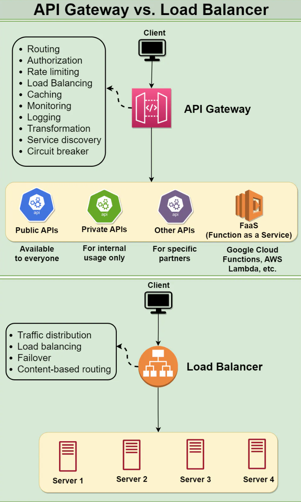

# Introduction to API Gateway
An API Gateway is a **server-side architectural component** in a software system that acts as an **intermediary** between clients (such as web browsers, mobile apps, or other services) and backend services, microservices, or APIs.

Its **main purpose** is to **provide a single entry point for external consumers to access the services and functionalities of the backend system**. It receives client requests, forwards them to the appropriate microservice, and then returns the server’s response to the client.

The API gateway is responsible for tasks such as **routing**, **authentication**, and **rate limiting**. This enables microservices to focus on their individual tasks and improves the overall performance and scalability of the system.

  

## Difference between an API gateway and a load balancer
An API gateway is **focused** on **routing requests to the appropriate microservice**, while a load balancer is **focused on distributing requests evenly across a group of backend servers**.

Another difference between the two is the **type of requests** that they typically handle. An API gateway is typically used to **handle requests for APIs**, which are web-based interfaces that allow applications to interact with each other over the internet. These requests typically have a specific URL that identifies the API that the client is trying to access, and the API gateway routes the request to the appropriate microservice based on this URL. A load balancer, on the other hand, is typically used to **handle requests that are sent to a single, well-known IP address**, and then routes them to one of many possible backend servers based on factors such as server performance and availability.

  

