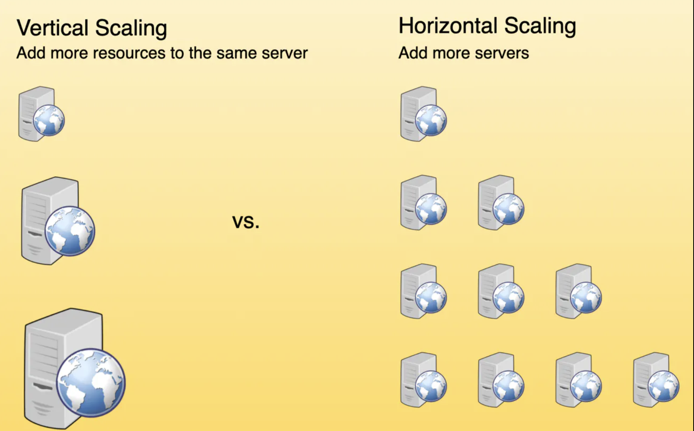

# Scalability
*Scalability* is the **ability of a system to handle an increasing workload**, either by **adding more resources** (*scaling out*) or by **upgrading the capacity of existing resources** (*scaling up*). In distributed systems, scalability is essential to **ensure that the system can effectively manage the growing demands of users**, **data**, and **processing power**. Here's an overview of the different aspects of scalability:

## 1. Horizontal Scaling
*Horizontal scaling*, also known as **scaling out**, involves **adding more machines** or **nodes** to a system to distribute the workload evenly. This approach allows the system to handle an increased number of requests without overloading individual nodes. Horizontal scaling is particularly useful in distributed systems because it provides a cost-effective way to manage fluctuating workloads and maintain high availability.

## 2. Vertical Scaling
*Vertical scaling*, or **scaling up**, refers to **increasing the capacity** of individual nodes within a system. This can be achieved by **upgrading the hardware**, such as adding more *CPU*, *memory*, or *storage*. Vertical scaling can help improve the performance of a system by allowing it to handle more workloads on a single node. However, this approach has limitations, as there is a physical limit to the amount of resources that can be added to a single machine, and it can also lead to single points of failure.

## Horizontal vs. Vertical Scaling

With **horizontal-scaling** it is often easier to **scale dynamically** by adding more machines into the existing pool; **Vertical-scaling** is usually **limited to the capacity of a single server** and scaling beyond that capacity often involves **downtime** and **comes with an upper limit**.

Good examples of horizontal scaling are Cassandra and MongoDB as they both provide an easy way to scale horizontally by adding more machines to meet growing needs. Similarly, a good example of vertical scaling is MySQL as it allows for an easy way to scale vertically by switching from smaller to bigger machines. However, this process often involves downtime.

  

# Availability
Availability is a *measure* of **how accessible** and **reliable** a system is to its users. In distributed systems, **high availability** is crucial to ensure that the system **remains operational** even in the **face of failures or increased demand**. It is the backbone that enables businesses to provide **uninterrupted services to their users**, regardless of any unforeseen circumstances. In today’s fast-paced digital world, where downtime can lead to significant financial losses and reputational damage, high availability has become a critical requirement for organizations across various industries.

## Definition of High Availability
*High availability* is often *measured* in terms of **uptime**, which is the ratio of time that a system is operational to the total time it is supposed to be operational. Achieving high availability involves **minimizing planned and unplanned downtime**, eliminating single points of failure, and implementing redundant systems and processes.

When it comes to distributed systems, high availability goes beyond simply ensuring that the system is up and running. It also **involves guaranteeing that the system can handle increased load** and **traffic without compromising its performance**. This scalability aspect is crucial, especially in scenarios where the user base grows rapidly or experiences sudden spikes in demand.

## Strategies for Achieving High Availability
To achieve high availability, organizations implement various strategies that focus on **redundancy**, **replication**, **load balancing**, **distributed data storage**, **health monitoring**, **regular system maintenance**, and **geographic distribution**.

### 1. High Availability through Redundancy and Replication
One of the *most effective strategies* for **achieving high availability** is **redundancy** and **replication**. By duplicating critical components or entire systems, organizations can ensure that if one fails, the redundant system takes over seamlessly, avoiding any interruption in service. Replication involves creating multiple copies of data, ensuring that it is available even if one copy becomes inaccessible.

**Redundancy** and **replication** are commonly used in mission-critical systems such as data centers, where multiple servers are deployed to handle the workload. In the event of a hardware failure or system crash, the redundant server takes over, ensuring uninterrupted service for users.

### 2. Availability through Load Balancing
Load balancing involves **distributing workloads** across multiple servers, ensuring that no single server is overwhelmed. Through intelligent load-balancing algorithms, organizations can optimize resource utilization, prevent bottlenecks, and enhance high availability by evenly distributing traffic.

Load balancing is particularly useful in web applications, where a large number of users access the system simultaneously. By distributing incoming requests across multiple servers, load balancers ensure that no single server becomes overloaded, leading to improved performance and availability.

### 3. Availability through Distributed Data Storage
**Storing data across multiple locations** or data centers enhances high availability by **reducing the risk of data loss or corruption**. Distributed data storage systems replicate data across geographically diverse locations, ensuring that even if one site experiences an outage, data remains accessible from other locations.

Distributed data storage is crucial for organizations that deal with large volumes of data and cannot afford to lose it. By **replicating data** across multiple sites, organizations can ensure that data is always available, even in the event of a catastrophic failure at one location.

### 4. Availability and Consistency Models (Strong, Weak, Eventual)
**Consistency models** define how a distributed system **maintains a coherent and up-to-date view of its data across all replicas**. **Different consistency models** provide **different trade-offs** between *availability*, *performance*, and *data correctness*. **Strong consistency** ensures that all replicas **have the same data at all times**, at the cost of **reduced availability and performance**. **Weak consistency** allows for **temporary inconsistencies between replicas**, with the advantage of **improved availability and performance**. **Eventual consistency** guarantees that all replicas will **eventually converge to the same data**, providing a **balance between consistency, availability, and performance**.

### 5. Availability through Health Monitoring and Alerts
Implementing robust health monitoring systems ensures that organizations **can proactively identify** and **address potential issues** before they impact system availability. **Real-time monitoring** and **automated alerts** enable timely response and rapid resolution of problems, minimizing downtime.

**Health monitoring** involves **continuously monitoring system performance**, **resource utilization**, and various metrics to detect any anomalies or potential issues. Alerts are triggered when predefined thresholds are exceeded, allowing IT teams to take immediate action and prevent service disruptions.

### 6. Availability through Regular System Maintenance and Updates
**Regular system maintenance and updates** are crucial for achieving high availability. By keeping systems up to date with the latest patches, security enhancements, and bug fixes, organizations can mitigate the risk of failures and vulnerabilities that could compromise system availability.

System maintenance involves tasks such as **hardware inspections**, **software updates**, and **routine checks** to ensure that all components are functioning correctly. By staying proactive and addressing any potential issues promptly, organizations can maintain high availability and **minimize the impact of system failures**.

### 7. Availability through Geographic Distribution
Geographic distribution is a strategy that involves deploying system components **across multiple locations or data centers**. This ensures that even if one region or data center experiences an outage, users can still access the system from other geographically dispersed locations.

Geographic distribution is particularly important for organizations with a global presence or those that rely heavily on cloud infrastructure. By strategically placing system components in different geographical areas, organizations can ensure that users from various locations can access the system without any interruptions, regardless of localized incidents or natural disasters.

# Latency and Performance
Latency and performance are critical aspects of distributed systems, as they directly impact the user experience and the **system's ability to handle large amounts of data and traffic**. In distributed systems, optimizing latency and performance involves considering factors such as **data locality**, **load balancing**, and **caching strategies**. Here's an overview of these aspects of latency and performance:

## 1. Data Locality
Data locality refers to the **organization and distribution of data within a distributed system** to minimize the amount of data that needs to be transferred between nodes. By storing related data close together or near the nodes that access it most frequently, you can reduce the latency associated with data retrieval and improve overall performance. Techniques to achieve data locality include **data partitioning**, **sharding**, and **data replication**.

## 2. Load Balancing
Load balancing is the process of distributing incoming network traffic or computational workload across multiple nodes or resources to ensure that no single node is overwhelmed. This helps to optimize resource utilization, minimize response times, and prevent system overloads. Various load balancing algorithms, such as round-robin, least connections, and consistent hashing, can be employed to achieve efficient load distribution and improved system performance.

## 3. Caching Strategies
Caching is a *technique* used to **store frequently accessed data** or **computed results temporarily**, allowing the system to quickly retrieve the data **from cache** instead of recalculating or fetching it from the primary data source. By implementing effective caching strategies, you can significantly reduce latency and improve the performance of your distributed system. Common caching strategies include **in-memory caching**, **distributed caching**, and **content delivery networks** (*CDNs*).

# Concurrency and Coordination
In distributed systems, **multiple processes** or **components** often need to **work together concurrently**, which can introduce *challenges* related to **coordination**, **synchronization**, and **data consistency**. Here's an overview of concurrency and coordination in distributed systems and the key aspects to consider:

## 1. Concurrency Control
Concurrency control is the **process of managing simultaneous access** to shared resources or data in a distributed system. It ensures that multiple processes can work together efficiently while avoiding conflicts or inconsistencies. Techniques for implementing concurrency control include:

- **Locking**: Locks are used to restrict access to shared resources or data, ensuring that only one process can access them at a time.
- **Optimistic concurrency control**: This approach assumes that conflicts are rare and allows multiple processes to work simultaneously. - **Conflicts are detected and resolved later**, usually through a **validation** and **rollback mechanism**.
- **Transactional memory**: This technique uses transactions to group together multiple operations that should be executed atomically, ensuring **data consistency and isolation**.

## 2. Synchronization
Synchronization is the process of **coordinating the execution of multiple processes or threads** in a distributed system to ensure correct operation. Synchronization can be achieved using various mechanisms, such as:

- **Barriers**: Barriers are used to synchronize the execution of multiple processes or threads, **ensuring that they all reach a specific point before proceeding**.
- **Semaphores**: Semaphores are signaling mechanisms that control access to shared resources and maintain synchronization among multiple processes or threads.
- **Condition variables**: Condition variables allow processes or threads to wait for specific conditions to be met before proceeding with their execution.

## Concurrency Control vs. Synchronization
### Concurrency Control:

- Primary Goal: The main objective of concurrency control is to **manage access to shared resources** (like data or hardware resources) in an environment where multiple processes or threads are executing simultaneously.
- Focus: It is **concerned with how to handle situations where multiple processes need to access or modify shared data at the same time**.

### Synchronization:

- Primary Goal: The purpose of synchronization is to **coordinate the timing of multiple concurrent processes or threads**. It's about **managing the execution order** and **timing of processes** to ensure correct operation.
- Focus: It **ensures that concurrent processes execute in a way that respects certain timing constraints**, like making sure certain operations happen before others or that operations do not interfere destructively with one another.

## 3. Coordination Services
Coordination services are specialized components or tools that help manage distributed systems' complexity by providing a set of abstractions and primitives for tasks like configuration management, service discovery, leader election, and distributed locking. Examples of coordination services include Apache ZooKeeper, etcd, and Consul.

## 4. Consistency Models
In distributed systems, consistency models define the rules for maintaining data consistency across multiple nodes or components. Various consistency models, such as *strict consistency*, *sequential consistency*, *eventual consistency*, and *causal consistency*, provide different levels of guarantees for data consistency and can impact the overall system performance, availability, and complexity.

Consistency models are fundamental in distributed systems, defining the rules for how and when changes made by one operation (like a write) become visible to other operations (like reads). Different models offer various trade-offs between consistency, availability, and partition tolerance. Here are some of the key consistency models, along with examples:

### 1. Strong Consistency
- Definition: After a write operation completes, any subsequent read operation will **immediately** see the new value.
- Example: Traditional relational databases (RDBMS) like MySQL or PostgreSQL typically offer strong consistency. If a record is updated in one transaction, any subsequent transaction will see that update.

### 2. Eventual Consistency
- Definition: Over time, all accesses to a particular data item will **eventually** return the last updated value. The time it takes to achieve consistency after a write is not guaranteed.
- Example: Amazon's DynamoDB uses eventual consistency. If you update a data item, the change **might not be immediately visible** to all users, but it will eventually propagate to all nodes.

### 3. Causal Consistency
- Definition: Operations that are causally related are seen by all processes in the same order. Concurrent operations might be seen in a different order on different nodes.
- Example: In a social media app, if a user posts a message and then comments on that post, any user who sees the comment must also see the original post.

### 4. Read-Your-Writes Consistency
- Definition: Guarantees that once a write operation completes, any subsequent reads (by the same client) will see that write or its effects.
- Example: A user profile update in a web application. Once the user updates their profile, they immediately see the updated profile data.

### 5. Session Consistency
- Definition: A stronger version of read-your-writes consistency. It extends this guarantee to a session of interactions, ensuring consistency within the context of a single user session.
- Example: In an e-commerce site's shopping cart, items added to the cart in a session will be consistently visible throughout that session.

### 6. Sequential Consistency
- Definition: Operations from all nodes or processes are seen in the same order. There is a global order of operations, but it doesn't have to be real-time.
- Example: A distributed logging system where logs from different servers are merged into a single, sequentially consistent log.

### 7. Monotonic Read Consistency
- Definition: Ensures that if a read operation reads a value of a data item, any subsequent read operations will never see an older value.
- Example: A user checking a flight status on an airline app will not see a departure time that goes back in time; it will only move forward.

### 8. Linearizability (Strong Consistency)
- Definition: A stronger version of sequential consistency, it ensures that all operations are atomic and instantly visible to all nodes.
- Example: In a distributed key-value store, once a new value is written to a key, any read operation on any node immediately reflects this change.

## Summary
Each consistency model addresses specific requirements and challenges in distributed systems, balancing the trade-offs between providing timely, consistent views of data and maintaining system performance and availability. The choice of a consistency model often depends on the specific requirements of the application and the nature of the data being managed.