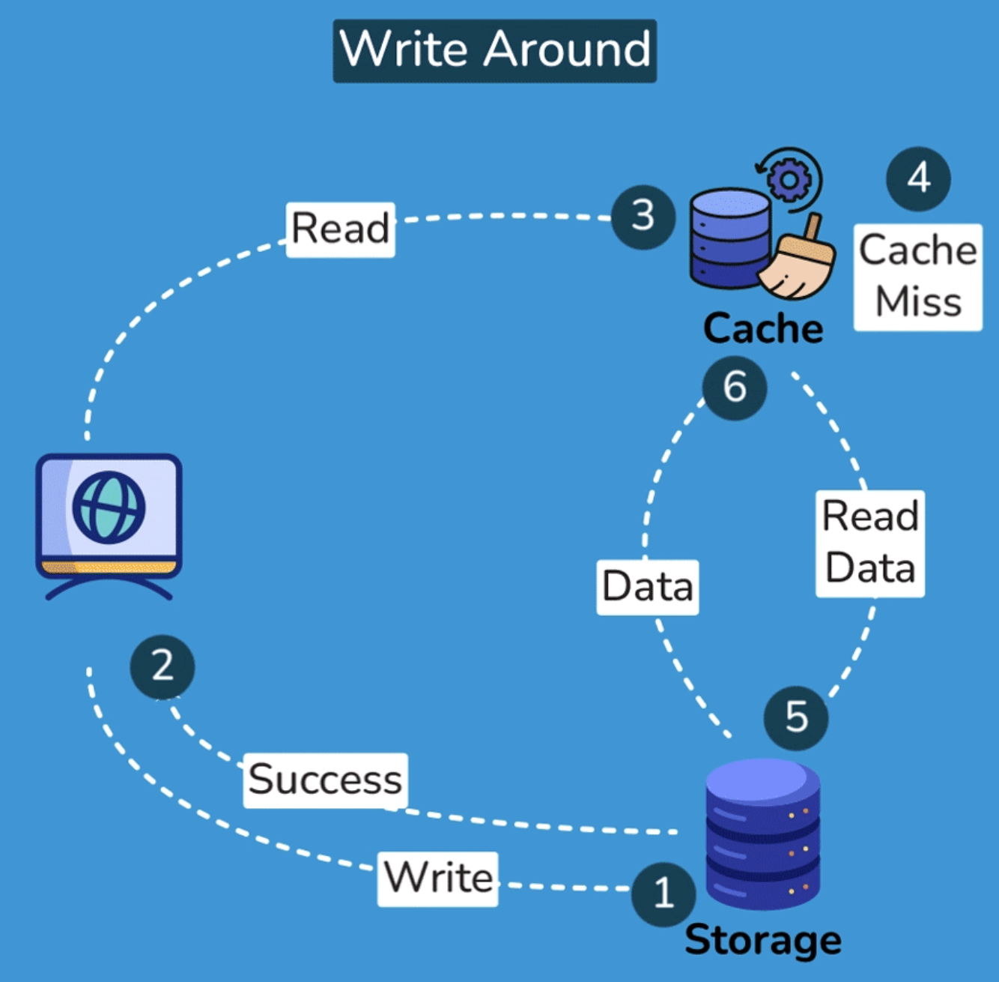

# Introduction to Caching

## What is Caching?
The cache is a **high-speed storage layer** that sits *between* the **application** and the **original source of the data**, such as a database, a file system, or a remote web service. When data is requested by the application, it is first checked in the cache. If the data is found in the cache, it is returned to the application. If the data is not found in the cache, it is retrieved from its original source, stored in the cache for future use, and returned to the application.

Caching can be used for various types of data, such as web pages, database queries, API responses, images, and videos. The goal of caching is to **reduce the number of times data needs to be fetched from its original source**, which can result in **faster processing** and **reduced latency**.

Caching can be implemented in various ways, including **in-memory caching**, **disk caching**, **database caching**, and **CDN caching**. *In-memory caching* stores data in the **main memory** of the computer, which is **faster to access than disk storage**. *Disk caching* stores data on the **hard disk**, which is **slower than main memory but faster than retrieving data from a remote source**. *Database caching* stores frequently accessed data in the **database** itself, **reducing the need to access external storage**. *CDN caching* stores data on a **distributed network of servers**, reducing the latency of accessing data from remote locations.

## Key terminology and concepts
### 1. Cache: A **temporary storage location** for data or computation results, typically designed for **fast access and retrieval**.

### 2. Cache hit: When a requested data item or computation result is **found** in the cache.

### 3. Cache miss: When a requested data item or computation result is **not found** in the cache and needs to be fetched from the original data source or recalculated.

### 4. Cache eviction: The process of **removing** data from the cache, typically to make room for new data or based on a predefined cache eviction policy.

### 5. Cache staleness: When the data in the cache is **outdated** compared to the original data source.

# Why is Caching Important?
Caching plays a critical role in i**mproving system performance** and **user experience** in software engineering. By storing frequently accessed data in a cache, applications can **reduce the response time** and **latency** of operations, resulting in faster and more efficient processing. Here are some reasons why caching is important:

## 1. Reduced latency
By serving data from the cache, which is typically faster to access than the original data source, caching can **significantly reduce the time** it takes to **retrieve the data**.

## 2. Improved system performance
Caching can **significantly improve the performance** of an application by **reducing the number of times data needs to be fetched** from its **original source**. Since cached data can be retrieved faster than from the original source, this results in a significant reduction in processing time, which leads to a more responsive application.

## 3. Reduced network load
Caching can also **reduce network load** by **minimizing the amount of data that needs to be transmitted over the network**. Since cached data is stored locally, there is no need to fetch data from the original source, **reducing the amount of data that needs to be transferred over the network**.

## 4. Increased scalability
Caching can **improve** the **scalability of an application** by **reducing the load on the original source**. By storing frequently accessed data in a cache, the original source is less likely to be overwhelmed with requests, making it more scalable.

## 5. Better user experience
Faster response times and **reduced latency** can lead to a better user experience. Applications that load quickly and respond to user requests in a timely manner are more likely to be used and preferred by users.

# Types of Caching
Caching can be implemented in various ways, depending on the specific use case and the type of data being cached. Here are some of the most common types of caching:

  

## 1. In-memory caching
In-memory caching stores data in the **main memory of the computer**, which is faster to access than disk storage. In-memory caching is useful for frequently accessed data that can fit into the available memory. This type of caching is commonly used for caching API responses, session data, and web page fragments. To implement in-memory caching, software engineers can use various techniques, including using a cache library like **Memcached or Redis**, or implementing custom caching logic within the application code.

## 2. Disk caching
Disk caching stores data on the hard disk, which is slower than main memory but faster than retrieving data from a remote source. Disk caching is **useful for data that is too large to fit in memory** or for data that **needs to persist between application restarts**. This type of caching is commonly used for caching database queries and file system data.

## 3. Database caching
Database caching stores frequently accessed data in the database itself, reducing the need to access external storage. This type of caching is useful for data that is stored in a database and frequently accessed by multiple users. Database caching can be implemented using a variety of techniques, including database query caching and result set caching.

## 4. Client-side caching
This type of caching occurs on the client device, such as a web browser or mobile app. Client-side caching stores frequently accessed data, such as images, CSS, or JavaScript files, to reduce the need for repeated requests to the server. Examples of client-side caching include **browser caching and local storage**.

## 5. Server-side caching
This type of caching occurs on the server, typically in web applications or other backend systems. Server-side caching can be used to store frequently accessed data, precomputed results, or intermediate processing results to improve the performance of the server. Examples of server-side caching include **full-page caching**, **fragment caching**, and **object caching**.

## 6. CDN caching
CDN caching stores data on a distributed network of servers, reducing the latency of accessing data from remote locations. This type of caching is useful for data that is accessed from multiple locations around the world, such as **images, videos, and other static assets**. CDN caching is commonly used for content delivery networks and large-scale web applications.

## 7. DNS caching
DNS cache is a type of cache used in the Domain Name System (DNS) to store the results of DNS queries for a period of time. When a user requests to access a website, their computer sends a DNS query to a DNS server to resolve the website’s domain name to an IP address. The DNS server responds with the IP address, and the user’s computer can then access the website using the IP address. DNS caching improves the performance of the DNS system by reducing the number of requests made to DNS servers. When a DNS server receives a request for a domain name, it checks its local cache to see if it has the IP address for that domain name. If the IP address is in the cache, the DNS server can immediately respond with the IP address without having to query other servers. This can significantly reduce the response time for DNS queries and improve the overall performance of the system.

  

# Cache Replacement Policies
When implementing caching, it’s important to have a cache replacement policy to determine which items in the cache should be removed when the cache becomes full. Here are some of the most common cache replacement policies:

## 1. Least Recently Used (LRU)
LRU is a cache replacement policy that **removes the least recently used** item from the cache when it becomes full. This policy assumes that items that have been accessed more recently are more likely to be accessed again in the future.

## 2. Least Frequently Used (LFU)
LFU is a cache replacement policy that **removes the least frequently used** item from the cache when it becomes full. This policy assumes that items that have been accessed more frequently are more likely to be accessed again in the future.

## 3. First In, First Out (FIFO)
FIFO is a cache replacement policy that **removes the oldest item from the cache** when it becomes full. This policy assumes that the oldest items in the cache are the least likely to be accessed again in the future.

## 4. Random Replacement
Random replacement is a cache replacement policy that **removes a random item** from the cache when it becomes full. This policy doesn’t make any assumptions about the likelihood of future access and can be useful when the **access pattern is unpredictable**.

## Comparison of different replacement policies
Each cache replacement policy has its **advantages** and **disadvantages**, and the best policy to use depends on the specific use case. LRU and LFU are generally more effective than FIFO and random replacement since they take into account the access pattern of the cache. However, LRU and LFU can be more expensive to implement since they require maintaining additional data structures to track access patterns. FIFO and random replacement are simpler to implement but may not be as effective in optimizing cache performance. Overall, the cache replacement policy used should be chosen carefully to balance the **trade-off** between **performance** and **complexity**.

# Cache Invalidation
## Cache Invalidation Strategies
While caching is fantastic, it requires some maintenance to keep the cache **coherent** with the source of truth (e.g., database). If the **data is modified in the database**, it **should be invalidated** in the cache; if not, this **can cause inconsistent application behavior**.

Solving this problem is known as **cache invalidation**; there are **four main schemes** that are used:

### 1. Write-through cache
Under this scheme, data is written into the cache and the corresponding database simultaneously. **The cached data allows for fast retrieval and, since the same data gets written in the permanent storage**, we will have complete data consistency between the cache and the storage. Also, this scheme ensures that **nothing will get lost in case of a crash**, **power failure, or other system disruptions**. Although, write-through minimizes the risk of data loss, since every write operation **must be done twice** before returning success to the client, this scheme has the **disadvantage** of **higher latency for write operations**.

  

### 2. Write-around cache
This technique is similar to write-through cache, but data is **written directly to permanent storage**, **bypassing the cache**. This can reduce the cache being flooded with write operations that will not subsequently be re-read, but has the disadvantage that a read request for recently written data will create a **“cache miss”** and must be **read from slower back-end storage** and **experience higher latency**.

  

### 3. Write-back cache
Under this scheme, data is **written to cache alone**, and completion is immediately confirmed to the client. The write to the permanent storage is done based on certain conditions, for example, when the system needs some free space. **This results in low-latency and high-throughput** for **write-intensive applications**; however, this speed comes with the **risk of data loss** in case of a crash or other adverse event because the only copy of the written data is in the cache.

  

### 4. Write-behind cache
It is quite **similar to write-back cache**. In this scheme, data is written to the cache and acknowledged to the application immediately, but it is not immediately written to the permanent storage. Instead, the write operation is deferred, and the **data is eventually written to the permanent storage at a later time**. The **main difference** between write-back cache and write-behind cache is when the data is written to the permanent storage. **In write-back caching**, data is **only written to the permanent storage when it is necessary for the cache to free up space**, while **in write-behind caching**, data is **written to the permanent storage** **at specified intervals**.

## Cache Invalidations Methods
Here are the famous cache invalidation methods:

### Purge
The purge method removes cached content for a specific object, URL, or a set of URLs. It’s typically used when there is an update or change to the content and the cached version is no longer valid. When a purge request is received, **the cached content is immediately removed**, and the next request for the content will be served directly from the origin server.
- note that from stackoverflow https://stackoverflow.com/questions/41480688/what-is-the-difference-between-bans-and-purge-in-varnish-http-cache, it seems like it can only remove one data at once

### Refresh
Fetches requested content from the origin server, even if cached content is available. When a refresh request is received, the cached content is updated with the latest version from the origin server, ensuring that the content is up-to-date. Unlike a purge, a refresh request doesn’t remove the existing cached content; instead, it **updates it with the latest version**.

### Ban
The ban method invalidates cached content based on specific criteria, such as a URL pattern or header. When a ban request is received, any cached content that matches the specified criteria is immediately removed, and subsequent requests for the content will be served directly from the origin server.
- note that, from https://stackoverflow.com/questions/41480688/what-is-the-difference-between-bans-and-purge-in-varnish-http-cache, it seems like it can remove multiple data at once due to it can be done with the use of regular expressions

### Time-to-live (TTL) expiration
This method involves **setting a time-to-live value for cached content**, after which the content is considered stale and must be refreshed. When a request is received for the content, the cache checks the time-to-live value and serves the cached content only if the value hasn’t expired. If the value has expired, the cache fetches the latest version of the content from the origin server and caches it.

### Stale-while-revalidate
This method is used in **web browsers** and **CDNs** to serve stale content from the cache while the content is being updated in the background. When a request is received for a piece of content, the **cached version is immediately served to the user**, and **an asynchronous request is made to the origin server** to fetch the **latest version of the content**. Once the latest version is available, the cached version is updated. This method ensures that the user is **always served content quickly, even if the cached version is slightly outdated**.

  

# Cache Read Strategies
Here are the two famous cache read strategies:

## Read through cache
A read-through cache strategy is a caching mechanism where the cache itself is responsible for retrieving the data from the underlying data store when a cache miss occurs. In this strategy, the application requests data from the cache instead of the data store directly. If the requested data is not found in the cache (cache miss), **the cache retrieves the data from the data store, updates the cache with the retrieved data, and returns the data to the application**.

This approach helps to maintain consistency between the cache and the data store, as the cache is always responsible for retrieving and updating the data. It also simplifies the application code since the application doesn't need to handle cache misses and data retrieval logic. The read-through cache strategy can significantly improve performance in scenarios where **data retrieval from the data store is expensive**, and cache misses are relatively infrequent.

## Read aside cache
A read-aside cache strategy, also known as **cache-aside or lazy-loading**, is a caching mechanism where the **application is responsible for retrieving the data from the underlying data store when a cache miss occurs**. In this strategy, the application first checks the cache for the requested data. If the data is found in the cache (cache hit), the application uses the cached data. However, if the data is not present in the cache (cache miss), the application retrieves the data from the data store, updates the cache with the retrieved data, and then uses the data.

The read-aside cache strategy provides **better control over the caching process**, as the application can decide when and how to update the cache. However, it also **adds complexity to the application code**, as the application must handle cache misses and data retrieval logic. This approach can be beneficial in scenarios where cache misses are relatively infrequent, and the application wants to **optimize cache usage based on specific data access patterns**.

  

# Cache Coherence and Consistency Models
Cache **coherence** and **consistency** models are essential concepts in the context of caching, particularly in distributed systems or multi-core processors. These models ensure that data **remains accurate and up-to-date across multiple caches or processing units**.

## Cache Coherence
Cache coherence is a property of multi-core processors or distributed systems that ensures all processors or nodes see the same view of shared data. In a system with multiple caches, each cache may store a local copy of the shared data. When one cache modifies its copy, it is essential that all other caches are **aware of the change to maintain a consistent view of the data**.

To achieve cache coherence, various protocols and techniques can be employed, such as:

- Write-invalidate: When a cache writes to its copy of the shared data, it **broadcasts a message to other caches**, **invalidating their copies**. When another cache requires the updated data, it **fetches the new data from the memory or the cache that made the change**.

- Write-update (or write-broadcast): When a cache writes to its copy of the shared data, it **broadcasts the updated data to all other caches**, which **update their local copies accordingly**.

## Cache Consistency Models
Cache consistency models **define the rules and guarantees for how data is updated and accessed in a distributed system with multiple caches**. Different consistency models offer varying levels of strictness, balancing performance with the need for data accuracy.

- Strict Consistency: In this model, any write to a data item is instantly visible to all caches. This model provides the highest level of consistency but is difficult to achieve in practice, as it may require significant synchronization overhead and negatively impact performance.

- Sequential Consistency: In this model, all operations on data items appear to occur in a specific sequential order across all caches. While this model allows for better performance than strict consistency, it still requires considerable synchronization and may not be practical in many distributed systems.

- Causal Consistency: In this model, operations that are causally related (i.e., one operation depends on the outcome of another) are guaranteed to appear in order across all caches. Operations that are not causally related can occur in any order. This model provides better performance than sequential consistency while still ensuring a reasonable level of data accuracy.

- Eventual Consistency: In this model, all updates to a data item will eventually propagate to all caches, but there is no guarantee about the order or timing of the updates. This model offers the best performance among the consistency models but provides the weakest consistency guarantees. Eventual consistency is often used in distributed systems where performance and scalability are prioritized over strict data accuracy.

## Summary
Understanding cache coherence and consistency models is crucial when designing caching strategies for distributed systems or multi-core processors. By selecting the appropriate model for your system, you can strike a balance between performance and data accuracy to meet your specific requirements.

# Caching Challenges
Cache-related problems are a set of challenges that arise when implementing and managing caching systems in software applications. Here are the **top cache-related problems** and their **possible workarounds**:

## 1. Thundering Herd
The thundering herd **problem occurs when a popular piece of data expires from the cache**, leading to a sudden surge in requests to the origin server to fetch the missing data. This can cause excessive load on the origin server and degrade performance. Solutions to the thundering herd problem include **using staggered expiration times**, **implementing a cache lock**, or using background updates to refresh the cache before the data expires.

## 2. Cache Penetration
Cache penetration refers to the situation where requests for data bypass the cache and directly access the origin server, reducing the benefits of caching. This typically happens when requests are made for non-existent or rarely accessed data. To mitigate cache penetration, negative caching (caching negative responses) or using a bloom filter to check for the existence of data before querying the cache can be employed.

## 3. Big Key
A big key is a large piece of data that consumes a significant portion of the cache's capacity. **Storing big keys can lead to cache evictions**, reducing the overall effectiveness of the caching system. Solutions for handling big keys include **compressing the data before caching**, **breaking the data into smaller chunks**, or **using a separate caching strategy specifically designed for large objects**.

## 4. Hot Key
A hot key refers to a piece of data that is frequently accessed, causing contention and performance issues in the caching system. Hot keys can lead to cache thrashing and an unbalanced distribution of load. Solutions for dealing with hot keys include **using consistent hashing to distribute the load more evenly**, **replicating the hot key across multiple cache nodes**, or **implementing a load balancing strategy to distribute requests across multiple instances of the hot key**.

## 5. Cache Stampede (or Dogpile)
Cache stampede occurs when **multiple requests** for the same data are made **simultaneously**, causing **excessive load on the cache** and the **origin server**. Cache stampede can be addressed using techniques such as **request coalescing** (*combining multiple requests for the same data into a single request*) or **implementing a read-through cache, where the cache itself fetches the missing data from the origin server**.

  

## 6. Cache Pollution
Cache pollution occurs **when less frequently accessed data displaces more frequently accessed data in the cache**, leading to a **reduced cache hit rate**. To mitigate cache pollution, **eviction policies like LRU (Least Recently Used) or LFU (Least Frequently Used) can be employed**, which prioritize retaining frequently accessed data in the cache.

## 7. Cache Drift
Cache drift refers to the **inconsistency between cached data and the data on the origin server**, typically **caused by updates or changes in the data**. To handle cache drift, proper cache invalidation strategies should be implemented to ensure that the cache is updated or invalidated when the data on the origin server changes.

## Summary
By understanding and addressing these cache-related problems, we can improve the efficiency, performance, and reliability of their caching systems. This, in turn, can enhance the overall performance and user experience of their applications.

# Cache Performance Metrics
When implementing caching, it’s important to measure the performance of the cache to ensure that it is effective in reducing latency and improving system performance. Here are some of the most common cache performance metrics:

## Hit rate
The hit rate is the **percentage of requests that are served by the cache without accessing the original source**. A high hit rate indicates that the cache is effective in reducing the number of requests to the original source, while a low hit rate indicates that the cache may not be providing significant performance benefits.

## Miss rate
The miss rate is the **percentage of requests that are not served by the cache and need to be fetched from the original source**. A high miss rate indicates that the cache may not be caching the right data or that the cache size may not be large enough to store all frequently accessed data.

## Cache size
The cache size is the **amount of memory or storage allocated for the cache**. The cache size can impact the hit rate and miss rate of the cache. A larger cache size can result in a higher hit rate, but it may also increase the cost and complexity of the caching solution.

## Cache latency
The cache latency is **the time it takes to access data from the cache**. A lower cache latency indicates that the cache is faster and more effective in reducing latency and improving system performance. The cache latency can be impacted by the caching technology used, the cache size, and the cache replacement and invalidation policies.