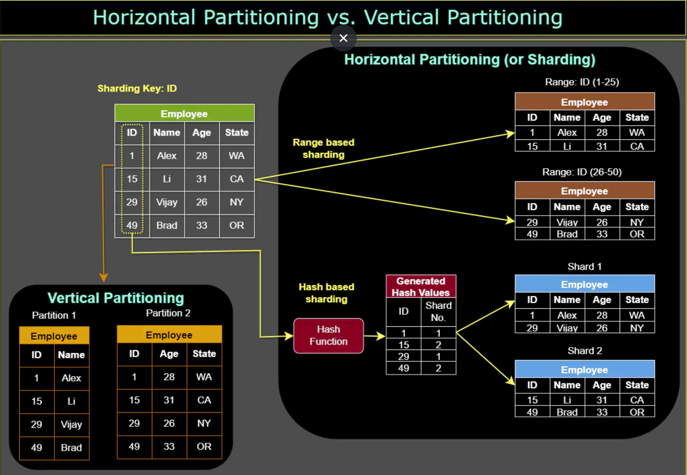

# Introduction to Data Partitioning
Data partitioning is a *technique* used in distributed systems and databases to **divide a large dataset into smaller**, **more manageable parts**, referred to as **partitions**. **Each partition is independent and contains a subset of the overall data**.

In data partitioning, the dataset is typically partitioned based on a certain criterion, such as **data range**, **data size**, or **data type**. **Each partition is then assigned to a separate processing node, which can perform operations on its assigned data subset independently of the others**.

Data partitioning can help improve the performance and scalability of large-scale data processing applications, as **it allows processing to be distributed across multiple nodes, minimizing data transfer and reducing processing time**. Secondly, by distributing the data across multiple nodes or servers, the workload can be balanced, and the system can handle more requests and process data more efficiently.

## Key terminology and concepts
- Partition: A partition is a smaller, more manageable part of a larger dataset, created as a result of data partitioning.

- Partition key: The partition key is a **data attribute** used to **determine how data is distributed across partitions**. An effective partition key should **provide an even distribution of data and support efficient query patterns**.

- Shard: A shard is a term often used interchangeably with a partition, particularly in the context of horizontal partitioning (will be discussed later).

# Partitioning Methods
Designing an effective partitioning scheme can be challenging and requires careful consideration of the application requirements and the characteristics of the data being processed. Below are three of the most popular schemes used by various large-scale applications.

## a. Horizontal Partitioning
Also known as sharding, horizontal data partitioning involves dividing a database table into multiple partitions or shards, with each partition containing a subset of rows. Each shard is typically assigned to a different database server, which allows for parallel processing and faster query execution times.

For example, consider a social media platform that stores user data in a database table. The platform might **partition the user table horizontally based on the geographic location of the users**, so that users in the United States are stored in one shard, users in Europe are stored in another shard, and so on. This way, when a user logs in and their data needs to be accessed, the query can be directed to the appropriate shard, **minimizing the amount of data that needs to be scanned**.

The key problem with this approach is that if the value whose range is used for partitioning isn’t chosen carefully, then the partitioning scheme will lead to unbalanced servers. For instance, partitioning users based on their geographic location assumes an even distribution of users across different regions, **which may not be valid due to the presence of densely or sparsely populated areas**.

## b. Vertical Partitioning
Vertical data partitioning involves **splitting a database table into multiple partitions or shards**, **with each partition containing a subset of columns**. This technique can help optimize performance by reducing the amount of data that needs to be scanned, especially when certain columns are accessed more frequently than others.

For example, consider an e-commerce website that stores customer data in a database table. The website might partition the customer table vertically based on the type of data, so that personal information such as name and address are stored in one shard, while order history and payment information are stored in another shard. This way, when a customer logs in and their order history needs to be accessed, the query can be directed to the appropriate shard, minimizing the amount of data that needs to be scanned.

  

## c. Hybrid Partitioning
Hybrid data partitioning combines both horizontal and vertical partitioning techniques to partition data into multiple shards. This technique can **help optimize performance by distributing the data evenly across multiple servers**, while also minimizing the amount of data that needs to be scanned.

For example, consider a large e-commerce website that stores customer data in a database table. The website might partition the customer table horizontally based on the geographic location of the customers, and then partition each shard vertically based on the type of data. This way, when a customer logs in and their data needs to be accessed, the query can be directed to the appropriate shard, minimizing the amount of data that needs to be scanned. Additionally, each shard can be stored on a different database server, allowing for parallel processing and faster query execution times.