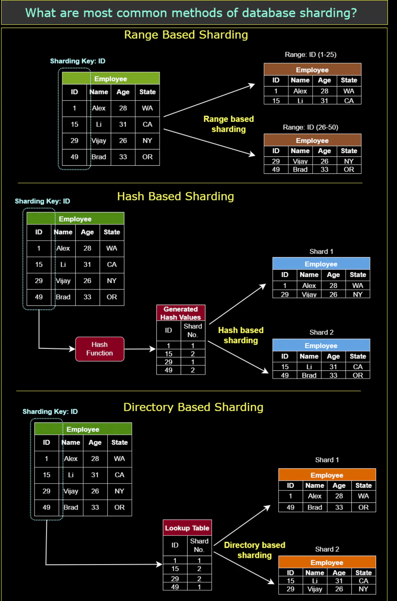

# Introduction to Data Partitioning
Data partitioning is a *technique* used in distributed systems and databases to **divide a large dataset into smaller**, **more manageable parts**, referred to as **partitions**. **Each partition is independent and contains a subset of the overall data**.

In data partitioning, the dataset is typically partitioned based on a certain criterion, such as **data range**, **data size**, or **data type**. **Each partition is then assigned to a separate processing node, which can perform operations on its assigned data subset independently of the others**.

Data partitioning can help improve the performance and scalability of large-scale data processing applications, as **it allows processing to be distributed across multiple nodes, minimizing data transfer and reducing processing time**. Secondly, by distributing the data across multiple nodes or servers, the workload can be balanced, and the system can handle more requests and process data more efficiently.

## Key terminology and concepts
- Partition: A partition is a smaller, more manageable part of a larger dataset, created as a result of data partitioning.

- Partition key: The partition key is a **data attribute** used to **determine how data is distributed across partitions**. An effective partition key should **provide an even distribution of data and support efficient query patterns**.

- Shard: A shard is a term often used interchangeably with a partition, particularly in the context of horizontal partitioning (will be discussed later).

# Partitioning Methods
Designing an effective partitioning scheme can be challenging and requires careful consideration of the application requirements and the characteristics of the data being processed. Below are three of the most popular schemes used by various large-scale applications.

## a. Horizontal Partitioning
Also known as sharding, horizontal data partitioning involves dividing a database table into multiple partitions or shards, with each partition containing a subset of rows. Each shard is typically assigned to a different database server, which allows for parallel processing and faster query execution times.

For example, consider a social media platform that stores user data in a database table. The platform might **partition the user table horizontally based on the geographic location of the users**, so that users in the United States are stored in one shard, users in Europe are stored in another shard, and so on. This way, when a user logs in and their data needs to be accessed, the query can be directed to the appropriate shard, **minimizing the amount of data that needs to be scanned**.

The key problem with this approach is that if the value whose range is used for partitioning isn’t chosen carefully, then the partitioning scheme will lead to unbalanced servers. For instance, partitioning users based on their geographic location assumes an even distribution of users across different regions, **which may not be valid due to the presence of densely or sparsely populated areas**.

## b. Vertical Partitioning
Vertical data partitioning involves **splitting a database table into multiple partitions or shards**, **with each partition containing a subset of columns**. This technique can help optimize performance by reducing the amount of data that needs to be scanned, especially when certain columns are accessed more frequently than others.

For example, consider an e-commerce website that stores customer data in a database table. The website might partition the customer table vertically based on the type of data, so that personal information such as name and address are stored in one shard, while order history and payment information are stored in another shard. This way, when a customer logs in and their order history needs to be accessed, the query can be directed to the appropriate shard, minimizing the amount of data that needs to be scanned.

  

## c. Hybrid Partitioning
Hybrid data partitioning combines both horizontal and vertical partitioning techniques to partition data into multiple shards. This technique can **help optimize performance by distributing the data evenly across multiple servers**, while also minimizing the amount of data that needs to be scanned.

For example, consider a large e-commerce website that stores customer data in a database table. The website might partition the customer table horizontally based on the geographic location of the customers, and then partition each shard vertically based on the type of data. This way, when a customer logs in and their data needs to be accessed, the query can be directed to the appropriate shard, minimizing the amount of data that needs to be scanned. Additionally, each shard can be stored on a different database server, allowing for parallel processing and faster query execution times.

# Data Sharding Techniques
Data sharding, a **type of horizontal partitioning**, is a technique used to distribute large datasets across multiple storage resources, often referred to as shards. By dividing data into smaller, more manageable pieces, sharding can improve performance, scalability, and resource utilization. Below are several data sharding techniques with examples:

## 1. Range-based Sharding
In range-based sharding, data is **divided into shards based on a specific range of values** for a given partitioning key. Each shard is responsible for a specific range, ensuring that the data is distributed in a predictable manner.

Example: An e-commerce platform stores order data and decides to shard it based on order dates. Shards can be created for specific date ranges, such as monthly or yearly intervals. When a query targets a specific date range, only the relevant shard needs to be accessed, which improves query performance.

## 2. Hash-based Sharding
Hash-based sharding involves **applying a consistent hash function to the partitioning key**, which generates a hash value that determines the destination shard for each data entry. This method **ensures an even distribution of data across shards and is particularly useful when the partitioning key has a large number of distinct values** or is not easily divided into ranges.

Example: A social media platform stores user data and decides to shard it based on user IDs. The platform applies a hash function to the user ID, generating a hash value that determines the shard for each user’s data. This approach ensures an even distribution of data across shards, optimizing storage efficiency and query performance.

## 3. Directory-based Sharding
Directory-based sharding uses a lookup table, often referred to as a directory, to map each data entry to a specific shard. This method offers greater flexibility, as shards can be added, removed, or reorganized without the need to rehash or reorganize the entire dataset. However, it introduces an additional layer of complexity, as the directory must be maintained and kept consistent.

Example: An online gaming platform stores player data and decides to use directory-based sharding. The platform maintains a directory that maps each player’s username to a specific shard. When a query targets a specific player’s data, the system first consults the directory to determine the relevant shard, then retrieves the data from that shard.

  

## 4. Geographical Sharding
Geographical sharding involves **partitioning data based on geographical locations**, such as countries or regions. This method can help reduce latency and improve performance for users in specific locations by storing their data closer to them.

Example: A global streaming service stores user data and decides to shard it based on the user’s country. Each shard contains data for users from a specific country, and these shards are stored in data centers located within or near that country. This approach ensures that users can access their data with lower latency, improving the streaming experience.

## 5. Dynamic Sharding
Dynamic sharding is an adaptive approach that automatically adjusts the number of shards based on the data’s size and access patterns. This method can help optimize resource utilization and performance by creating shards as needed and merging or splitting them as the data grows or shrinks.

Example: An IoT platform collects sensor data from a large number of devices. The platform uses dynamic sharding to automatically adjust the number of shards based on the volume and frequency of incoming data. As more devices are added or removed, the platform can create or merge shards accordingly, ensuring optimal resource utilization and performance.

## 6. Hybrid Sharding: The Best of Many Worlds
Why stick to one method when you can combine a few and get the best results? Hybrid Sharding is a blend of multiple sharding strategies to optimize performance. It might combine Geo-based with Directory-based sharding, or any other mix that suits a system's needs.
Its Strength: By tailoring solutions and leveraging the strengths of different techniques, systems can achieve unprecedented efficiency levels.
Snapshot: Many cloud service providers, given their diverse clientele and global infrastructure, adopt hybrid sharding. It's their secret sauce to ensure consistent, high-speed services across the board.

# Benefits of Data Partitioning
Data partitioning offers a wide range of benefits that can significantly improve the performance, scalability, and resilience of data-driven systems. By understanding the various advantages and their real-world applications, we can **effectively implement data partitioning strategies tailored to our specific needs, resulting in more efficient and reliable data management**. Here are the top benefits of data partitioning:

## 1. Improved Query Performance
Data partitioning can significantly improve query performance by reducing the amount of data that needs to be processed for a given query. When data is partitioned, queries can be targeted at specific partitions, enabling the system to retrieve only the necessary data and ignore irrelevant partitions.

Example: An online bookstore uses range partitioning to divide its inventory data based on book genres. When a customer searches for mystery novels, the system only needs to query the mystery partition, avoiding the need to search through data for other genres, such as romance or science fiction.

## 2. Enhanced Scalability
Partitioning data across multiple storage resources allows for greater system scalability. As the dataset grows, new partitions can be added to accommodate the additional data, without negatively impacting the performance of existing partitions.

Example: A social media platform uses horizontal partitioning to divide user data based on the user’s registration date. As more users join the platform, new partitions are created to store the data for these new users, ensuring that the system remains scalable and responsive as it grows.

## 3. Load Balancing
Data partitioning helps distribute the workload evenly across multiple storage nodes or servers. This load balancing ensures that no single node becomes a bottleneck, leading to better overall system performance and reliability.

Example: A messaging service uses round-robin partitioning to distribute messages across multiple storage nodes. Each message is assigned to a different node in a cyclic manner, ensuring that the workload is balanced and no single node is overwhelmed with too many messages.

## 4. Data Isolation
Partitioning data can provide a level of data isolation, where the failure or corruption of one partition does not necessarily impact the other partitions. This isolation can help improve the overall robustness and resilience of the system.

Example: A financial institution uses vertical partitioning to separate sensitive customer information, such as social security numbers and account numbers, from less sensitive data, such as transaction history. In the event of a data breach, the impact can be limited to only the affected partition, protecting the remaining data from potential exposure.

## 5. Parallel Processing
Data partitioning enables parallel processing, where multiple partitions can be processed simultaneously by different processors or systems. This parallelism can lead to significant performance improvements, especially for large-scale data processing tasks.

Example: An e-commerce company uses horizontal partitioning to divide customer order data based on geographical regions. During peak sales periods, each regional partition can be processed by a separate server, allowing for faster processing of orders and reduced system bottlenecks.

## 6. Storage Efficiency
By partitioning data based on usage patterns or data relevance, organizations can achieve more efficient storage utilization. Frequently accessed data can be stored on faster, more expensive storage resources, while less critical data can be stored on cheaper, slower storage resources.

Example: A video streaming service uses vertical partitioning to store high-resolution video files separately from lower-resolution versions. By storing high-resolution files on high-performance storage resources and lower-resolution files on more cost-effective storage resources, the service can optimize storage efficiency while maintaining high-quality streaming for users.

## 7. Simplified Data Management
Data partitioning can make data management tasks, such as backup, archiving, and maintenance, more manageable and efficient. By dealing with smaller, more focused partitions, these tasks can be performed more quickly and with less impact on overall system performance.

Example: An online news platform uses range partitioning to store articles based on their publication dates. This approach allows the platform to easily archive older articles or perform backups on specific date ranges without affecting the performance of the entire dataset.

## 8. Better Resource Utilization
Partitioning data based on specific attributes or access patterns can lead to better resource utilization. By aligning the data with the appropriate storage and processing resources, organizations can maximize the performance and efficiency of their data-driven systems.

Example: A weather forecasting service uses horizontal partitioning to store weather data based on geographical locations. This allows the service to allocate more resources to process data for areas with higher user demand, ensuring that resources are used efficiently and in line with user needs.

## 9. Improved Data Security
Data partitioning can help enhance data security by segregating sensitive information from less sensitive data. By isolating sensitive data in separate partitions, organizations can implement stronger security measures for those partitions, minimizing the risk of unauthorized access or data breaches.

Example: A healthcare provider uses vertical partitioning to separate patient medical records from demographic data. By storing sensitive medical records in a separate partition with strict access controls and encryption, the provider can better protect patient privacy and comply with data protection regulations.

## 10. Faster Data Recovery
In the event of a system failure or data loss, partitioning can help speed up the data recovery process. By focusing on recovering specific partitions rather than the entire dataset, organizations can reduce downtime and restore critical data more quickly.

Example: A multinational corporation uses horizontal partitioning to store sales data based on regional markets. If a system failure occurs, the company can prioritize the recovery of the most critical regional partitions, ensuring that essential operations can be resumed as soon as possible.

