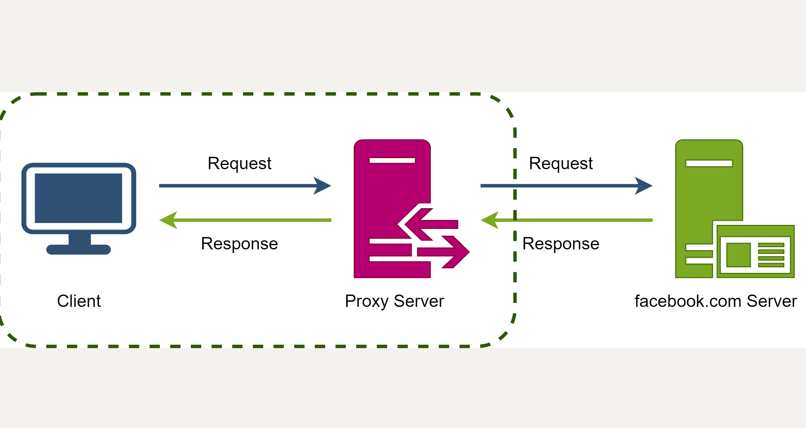
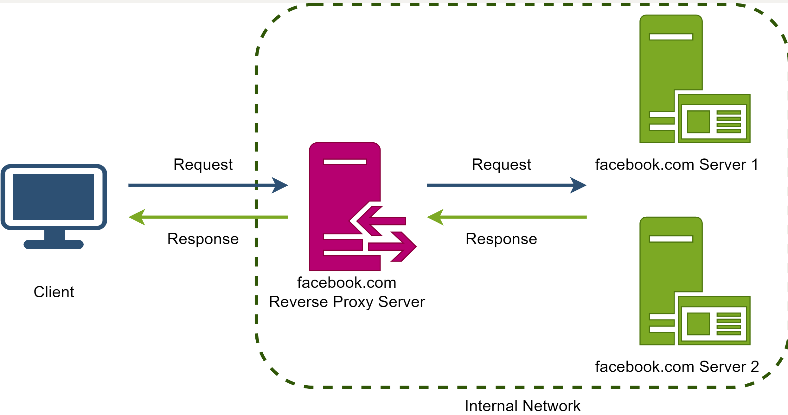
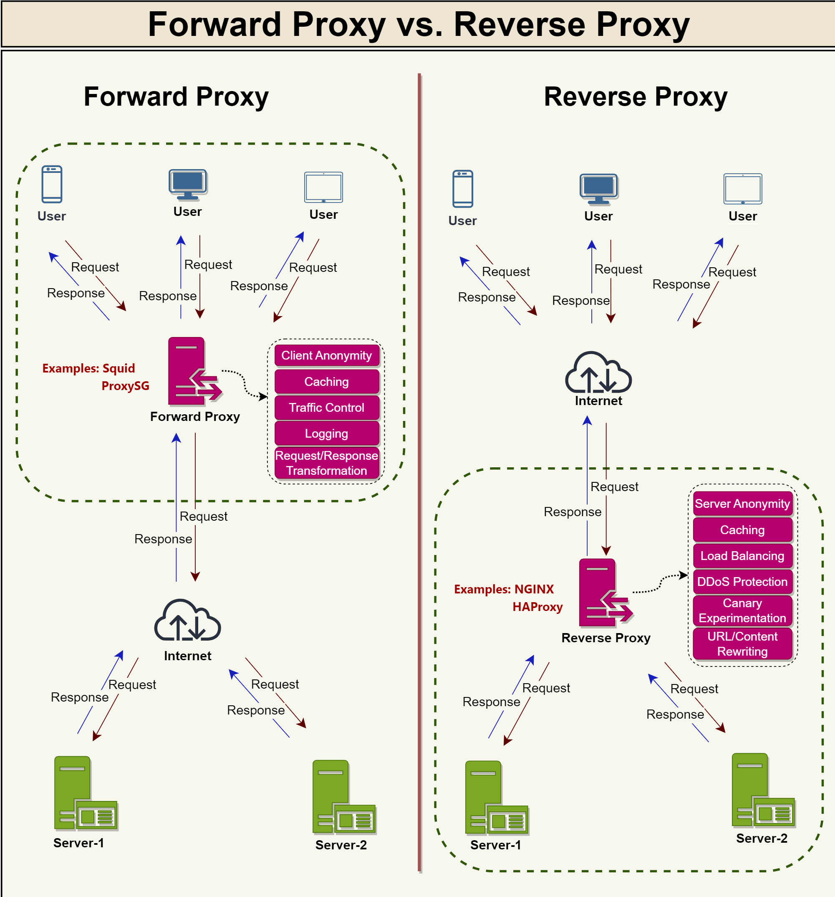

# What is a Proxy Server?

## Forward Proxy
A **forward proxy**, also known as a "proxy server," or simply "proxy," is a **server that sits in front of one or more client machines and acts as an intermediary between the clients and the internet**. When a client machine makes a request to a resource (like a web page or file) on the internet, the request is first sent to the forward proxy. The forward proxy then forwards the request to the internet on behalf of the client machine and returns the response to the client machine.

Typically, forward proxies are used to cache data, filter requests, log requests, or transform requests (by adding/removing headers, encrypting/decrypting, or compressing a resource).

**A forward proxy can hide the identity of the client from the server by sending requests on behalf of the client.**

In addition to coordinating requests from multiple servers, proxies can also optimize request traffic from a system-wide perspective. Proxies can combine the same data access requests into one request and then return the result to the user; this technique is called **collapsed forwarding**. Consider a request for the same data across several nodes, but the data is not in cache. By routing these requests through the proxy, they can be consolidated into one so that we will only read data from the disk once.

  

## Reverse Proxy
A reverse proxy is **a server that sits in front of one or more web servers and acts as an intermediary between the web servers and the Internet**. When a client makes a request to a resource on the internet, the request is first sent to the reverse proxy. The reverse proxy then forwards the request to one of the web servers, which returns the response to the reverse proxy. The reverse proxy then returns the response to the client.

**Contrary to the forward proxy, which hides the client's identity, a reverse proxy hides the server's identity.**

  

In the above diagram, the reverse proxy hides the final server that served the request from the client. The client makes a request for some content from facebook.com; this request is served by facebook’s reverse proxy server, which gets the response from one of the backend servers and returns it to the client.

A reverse proxy, just like a forward proxy, can be used for caching, load balancing, or routing requests to the appropriate servers.

  

## Summary
A proxy is a piece of software or hardware that sits between a client and a server to facilitate traffic. A forward proxy hides the identity of the client, whereas a reverse proxy conceals the identity of the server. So, when you want to protect your clients on your internal network, you should put them behind a forward proxy; on the other hand, when you want to protect your servers, you should put them behind a reverse proxy.

# Uses of Proxies
Proxy servers serve a variety of purposes in networked environments, often enhancing performance, security, and privacy. The following are some common uses of proxy servers:

## 1. Performance enhancement
Proxy servers can cache frequently accessed content, reducing the need for repeated requests to the target server. This caching mechanism can improve response times, reduce bandwidth usage, and decrease the load on target servers.

## 2. Security enhancement
Proxy servers can act as a protective barrier between clients and target servers, enforcing access control policies and filtering malicious or harmful content. By monitoring and filtering network traffic, proxy servers can help protect internal networks from external threats and prevent unauthorized access to sensitive resources.

## 3. Anonymity and privacy
Proxy servers can mask the client's IP address and other identifying information, providing a level of anonymity and privacy when accessing the internet or other network resources. This is particularly useful for clients who wish to access content that is restricted based on geographic location or to avoid tracking and surveillance.

## 4. Load balancing
Reverse proxy servers can distribute client requests across multiple target servers, preventing individual servers from becoming overburdened and ensuring high availability and performance. Load balancing can be particularly beneficial for large-scale applications and services with high levels of concurrent users or requests.

## 5. Centralized control and monitoring
Proxy servers enable centralized control and monitoring of network traffic, facilitating easier administration and management of network resources. Administrators can implement policies, filters, and other configurations on the proxy server to manage traffic and optimize network performance.

## 6. Content filtering and access control
Proxy servers can be configured to block or filter specific content types, websites, or services based on predetermined policies. This functionality is often used in educational and corporate environments to enforce acceptable use policies or comply with regulatory requirements.

## 7. Content adaptation and transformation
Proxy servers can modify and adapt content to suit specific client requirements, such as altering image formats, compressing data, or adjusting content for mobile or low-bandwidth devices. This capability enhances the user experience by ensuring that content is optimized for the client's device and network conditions.

## 8. Logging and auditing
Proxy servers can log and record network traffic, providing a valuable source of information for auditing, troubleshooting, and monitoring purposes. Detailed logs can help administrators identify performance issues, security vulnerabilities, or policy violations and take appropriate corrective action.

## 9. SSL termination
Reverse proxy servers can handle SSL/TLS encryption and decryption, offloading this task from the target servers. This process, known as SSL termination, can improve the performance of target servers by reducing the computational overhead associated with encryption and decryption.

## 10. Application-level gateway
Proxy servers can act as an application-level gateway, processing and forwarding application-specific requests and responses between clients and servers. This capability allows proxy servers to provide added functionality, such as authentication, content filtering, or protocol translation, at the application level.