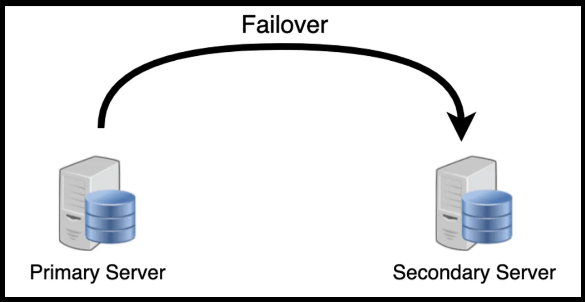
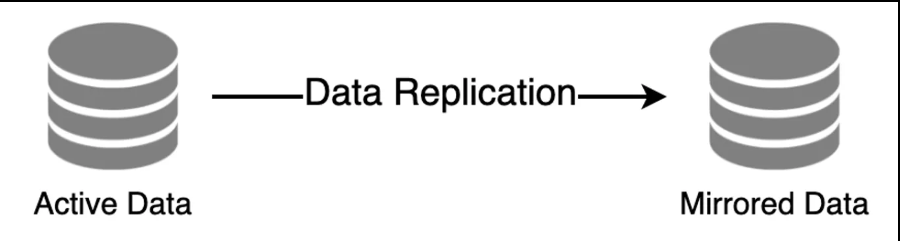
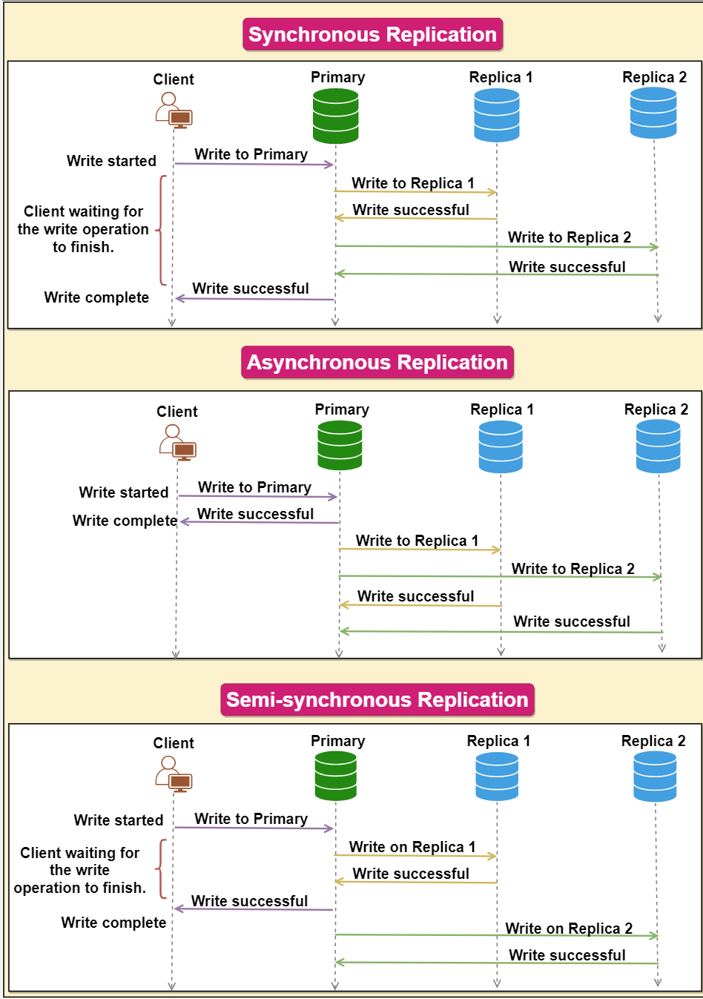

# What is Redundancy?
Redundancy refers to the **duplication of critical components or functions to increase the reliability, availability, and fault tolerance of a system**. The primary purpose of redundancy is to **prevent system failures and ensure continuous operation**, even in the event of hardware, software, or network issues. Redundant systems are designed to **maintain functionality and performance despite component failures**, providing increased resilience against downtime and data loss.

Redundancy plays a key role in **removing the single points of failure in the system** and provides backups if needed in a crisis. For example, if we have two instances of a service running in production and one fails, the system can **failover** to the other one.

  

## Benefits of redundancy in system design
Implementing redundancy in system design offers numerous advantages:

### 1. Improved reliability
Redundant systems are more reliable, as they can continue to function despite individual component failures. This increased reliability reduces the likelihood of system outages, ensuring the availability of critical services and applications.

### 2. Enhanced fault tolerance
By incorporating redundant components, a system can better tolerate and recover from faults or failures. This fault tolerance is essential for maintaining high availability and minimizing downtime, particularly in mission-critical systems.

### 3. Increased availability
Redundant systems are designed to provide continuous operation, ensuring that services and applications remain available even during component failures or maintenance. This increased availability is crucial for organizations that rely on 24/7 access to their systems and data.

### 4. Simplified maintenance
Redundancy allows for maintenance and upgrades to be performed without disrupting system operation. By having backup components in place, administrators can perform maintenance on one part of the system while the redundant components continue to provide service.

### 5. Disaster recovery
Redundancy plays a crucial role in disaster recovery planning. By having multiple, geographically distributed copies of data and resources, organizations can recover more quickly from disasters or catastrophic events that may affect a single location.

## Conclusion
Overall, implementing redundancy in system design is essential for ensuring the reliability, availability, and fault tolerance of modern computing systems. It helps prevent downtime, data loss, and other issues that can negatively impact user experience, productivity, and business operations.

# What is Replication?
Database replication is the **process of copying and synchronizing data from one database to one or more additional databases**. This is commonly used in distributed systems where multiple copies of the same data are required to ensure data availability, fault tolerance, and scalability.

Replication is widely used in many **database management systems** (DBMS), usually with a primary-replica relationship between the original and the copies. The primary server gets all the updates, which then ripple through to the replica servers. Each replica outputs a message stating that it has received the update successfully, thus allowing the sending of subsequent updates.

  

## Redundancy vs. Replication: Key Differences
1. Active vs. Passive:

- Redundancy is often passive – the backup components are there in case of failure but are not actively used in normal operations.
-Replication is active – all copies of the data are usually utilized in some way, either for load balancing or data recovery.

2. Focus:

- Redundancy focuses on the **reliability and availability** of the overall system.
- Replication focuses on the **availability and integrity** of the data.

3. Implementation:

- Redundancy might involve **identical backup systems or components**.
- Replication involves **distributing and synchronizing data across different systems**.

In essence, while both redundancy and replication are about ensuring high availability and system reliability, **redundancy is more about having backup resources at the ready**, and replication is about **keeping multiple active copies of data**. In distributed systems, using both strategies can significantly enhance performance and reliability.

## Replication Strategies

1. Synchronous replication
Synchronous replication is a type of database replication where changes made to the primary database are immediately replicated to the replica databases before the write operation is considered complete. In other words, the primary database waits for the replica databases to confirm that they have received and processed the changes before the write operation is acknowledged.

In synchronous replication, there is a strong consistency between the primary and replica databases, as all changes made to the primary database are immediately reflected in the replica databases. This ensures that the data is consistent across all databases and reduces the risk of data loss or inconsistency.

2. Asynchronous replication
Asynchronous replication is a type of database replication where changes made to the primary database are not immediately replicated to the replica databases. Instead, the changes are queued and replicated to the replicas at a later time.

In asynchronous replication, there is a delay between the write operation on the primary database and the update on the replica databases. This delay can result in temporary inconsistencies between the primary and replica databases, as the data on the replica databases may not immediately reflect the changes made to the primary database.

However, asynchronous replication can also have performance benefits, as write operations can be completed quickly without waiting for confirmation from the replica databases. In addition, if one or more replica databases are unavailable, the write operation can still be completed on the primary database, ensuring that the system remains available.

3. Semi-synchronous replication
Semi-synchronous replication is a type of database replication that combines elements of both synchronous and asynchronous replication. In semi-synchronous replication, changes made to the primary database are immediately replicated to at least one replica database, while other replicas may be updated asynchronously.

In semi-synchronous replication, the write operation on the primary is not considered complete until at least one replica database has confirmed that it has received and processed the changes. This ensures that there is some level of strong consistency between the primary and replica databases, while also providing improved performance compared to fully synchronous replication

  

