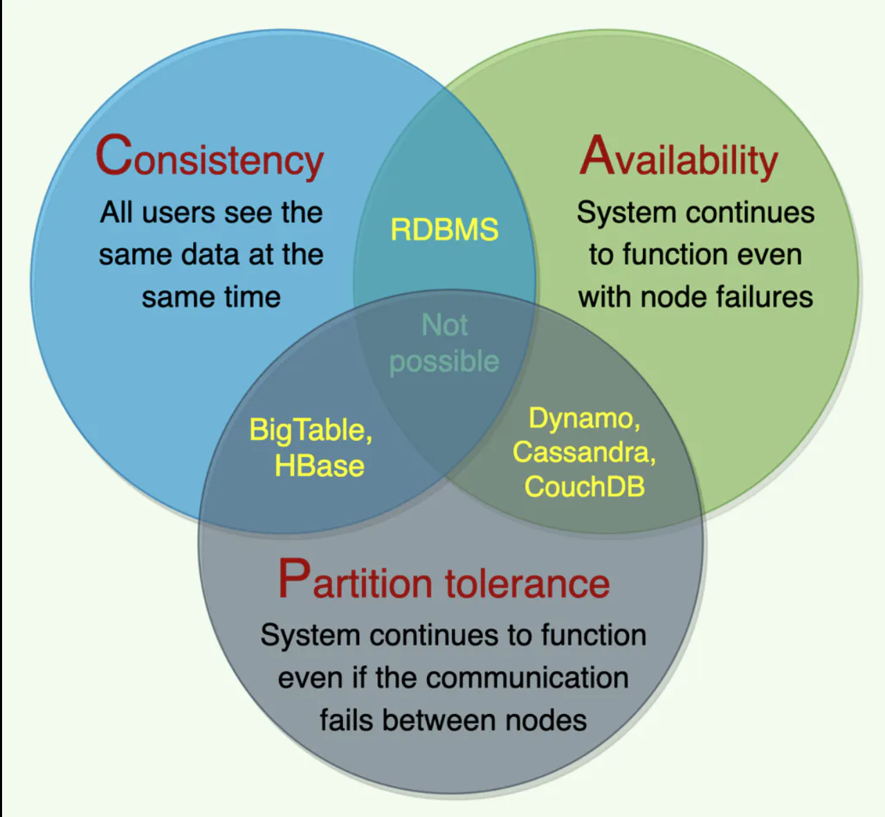

# Introduction to CAP Theorem
The **CAP theorem**, also known as **Brewer's theorem**, is a fundamental concept in distributed systems design. It was introduced by Eric Brewer in 2000. The CAP theorem provides a framework for understanding the trade-offs between three essential properties of distributed systems: **consistency**, **availability**, and **partition tolerance**.

## a. Background and history
Before the introduction of the CAP theorem, distributed systems were primarily designed with a focus on consistency and availability, often ignoring partition tolerance. However, as distributed systems grew in scale and complexity, it became evident that addressing network partitions was crucial for ensuring reliable and fault-tolerant operation.

## b. Overview of the CAP theorem
The CAP theorem states that **it is impossible for a distributed system to simultaneously provide all three properties**: *consistency*, *availability*, and *partition tolerance*. In other words, a distributed system **can only guarantee two out of these three properties** at any given time. The theorem highlights the inherent trade-offs that system designers must consider when building distributed systems.

- Consistency: A system is considered consistent if all nodes see the same data at the same time. This means that any read operation should return the most recent write operation's result, ensuring that the system maintains a single, up-to-date version of the data.

- Availability: A system is considered highly available if it continues to operate and respond to requests despite failures, ensuring that every request receives a response, either a success or an error.

- Partition Tolerance: A system is considered partition-tolerant if it can continue to operate and maintain its guarantees despite network partitions, which are situations where communication between nodes in the system is interrupted or lost.

The CAP theorem provides a useful guideline for understanding the limitations of distributed systems and making informed design decisions that balance the needs for consistency, availability, and partition tolerance.

  

# Components of CAP Theorem
The CAP theorem revolves around three key properties of distributed systems: *Consistency*, *Availability*, and *Partition Tolerance*. Each of these properties plays a vital role in determining the behavior of a distributed system under various conditions.

## a. Consistency
Consistency in distributed systems refers to the degree to which the system maintains a single, up-to-date version of the data. There are different levels of consistency, depending on the requirements of the system.

- Strong consistency: In a strongly consistent system, **all nodes see the same data at the same time**. Any read operation returns the most recent write operation's result, ensuring that the system maintains a single, coherent version of the data. Strong consistency is desirable for applications that require accurate and up-to-date information at all times, such as financial transactions or inventory management systems.

- Eventual consistency: In an eventually consistent system, **nodes may temporarily have different versions of the data**, but they **will eventually converge to the same, consistent state**. Eventual consistency is suitable for applications where slight inconsistencies can be tolerated for short periods, such as social media updates or user profiles. This model offers better availability and performance compared to strong consistency, at the cost of temporary data inconsistencies.

## b. Availability
Availability refers to the **ability of a distributed system to continue operating and responding to requests despite failures or partial outages**. Highly available systems ensure that every request receives a response, either a success or an error, without significant delays.

- High availability: High availability is achieved by replicating data across multiple nodes and designing the system to handle failures gracefully. In a highly available system, the loss of individual nodes does not cause a significant impact on the overall operation, as other nodes can continue to serve requests.

## c. Partition Tolerance
Partition tolerance is a critical property of distributed systems, as it determines the system's ability to handle network partitions and communication failures.

- Network partitioning: In a distributed system, nodes communicate with each other over a network. Network partitions occur when communication between some or all nodes is interrupted or lost. This can be caused by various reasons, such as hardware failures, network congestion, or configuration issues.

- Handling partition failures: Partition-tolerant systems are designed to handle network partitions gracefully and continue to operate without compromising their guarantees. This often involves strategies such as data replication, fallback mechanisms, and automatic recovery processes. However, as the CAP theorem states, it is impossible to guarantee consistency, availability, and partition tolerance simultaneously, so system designers must make trade-offs based on the specific requirements of their application.

# Trade-offs in Distributed Systems
When designing distributed systems, architects and engineers need to make informed decisions about the **trade-offs between the three properties** of the CAP theorem: **consistency**, **availability**, and **partition tolerance**. Understanding these trade-offs is crucial for building systems that meet the desired performance, reliability, and user experience goals.

## a. Understanding the trade-offs in CAP theorem
As the CAP theorem states, it is impossible for a distributed system to simultaneously provide consistency, availability, and partition tolerance. This means that system designers must choose which two of these properties are most important for their specific application and make compromises on the third property. For example, some systems may prioritize consistency and partition tolerance (CP) over availability, while others may prioritize availability and partition tolerance (AP) over consistency.

### CAP Theorem and Distributed Systems:
- Partition Tolerance: This is a necessity in any distributed system. It refers to the system's ability to continue operating despite network partitions or communication breakdowns between nodes in the system.
- Trade-offs:
    - If a system chooses Consistency and Partition Tolerance (CP), it may sacrifice availability, meaning that if a network partition happens, some users might not be able to access the data until the partition is resolved.
    - If a system chooses Availability and Partition Tolerance (AP), it can lead to temporary inconsistencies in the system, where not all nodes have the same data at the same time.

## b. Selecting the right trade-offs for your system
To make the best decisions regarding the trade-offs in a distributed system, consider the following factors:

- Application requirements: What are the specific needs of your application? Does it require real-time data consistency, or can it tolerate eventual consistency? Is high availability a critical requirement, or can the system afford to experience occasional downtime?

- Data access patterns: How is the data accessed and updated in your system? Are read operations more frequent than write operations, or vice versa? Understanding the data access patterns can help you optimize the system for performance and consistency.

- Failure scenarios: Consider the possible failure scenarios and their impact on your system. What are the risks associated with network partitions, node failures, or data corruption? How can your system handle these failures while maintaining its guarantees?

- Scalability: How will your system scale as the number of users, requests, and data volume grows? Consider the scalability implications of your chosen trade-offs and how they will impact the system's performance and reliability.

## Summary
By carefully considering these factors, you can make informed decisions about the trade-offs between consistency, availability, and partition tolerance, resulting in a distributed system that meets your application's requirements and provides an optimal user experience.

# Examples of CAP Theorem in Practice
The CAP theorem plays a crucial role in the design and implementation of distributed systems. To better understand the practical implications of the CAP theorem, let's examine some examples of distributed systems and their trade-offs between consistency, availability, and partition tolerance.

## a. Consistency and Partition Tolerance (CP) Systems
Some distributed systems prioritize consistency and partition tolerance over availability. In these systems, the focus is on ensuring that all nodes have the same data at the same time, even if it means sacrificing some availability during network partitions or node failures.

Example: Google's Bigtable
Bigtable is a distributed storage system used by Google to manage structured data. It is designed to provide **strong consistency**, ensuring that all nodes see the same data at the same time. To achieve this, Bigtable uses a single-master architecture, where a master node coordinates all write operations. During network partitions or master node failures, the system sacrifices availability to maintain consistency and partition tolerance.

## b. Availability and Partition Tolerance (AP) Systems
Some distributed systems **prioritize availability and partition tolerance over consistency**. These systems are designed to remain operational and responsive to user requests even during network partitions or node failures, at the cost of potentially serving stale or inconsistent data.

Example: Amazon's DynamoDB
DynamoDB is a managed NoSQL database service provided by Amazon Web Services (AWS). It is designed to provide high availability and partition tolerance by using a **multi-master architecture** and allowing **eventual consistency**. In this system, nodes can accept write operations independently, even during network partitions. However, this design may lead to temporary inconsistencies as data eventually converges across nodes.

## c. Consistency and Availability (CA) Systems
While the CAP theorem implies that a distributed system must sacrifice either consistency or availability in the presence of network partitions, some systems prioritize consistency and availability in environments where network partitions are rare or can be quickly resolved.

Example: Traditional Relational Databases
Traditional relational databases, such as MySQL or PostgreSQL, are often designed with a focus on consistency and availability. These systems use transactions and ACID (Atomicity, Consistency, Isolation, Durability) properties to ensure data consistency. However, they are typically not built to handle network partitions gracefully and may experience reduced availability or performance during such events.