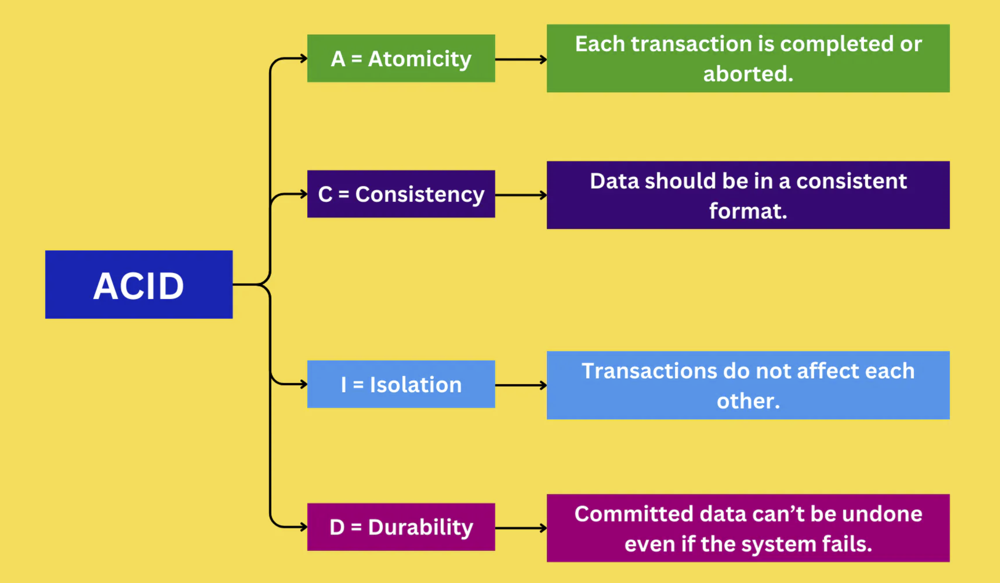
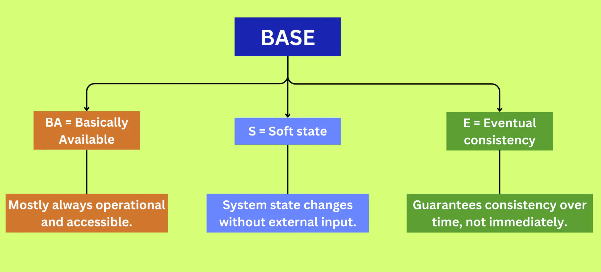

# Introduction to Databases
A database is an organized collection of structured data that is stored and managed electronically. Databases are essential tools for managing, storing, and retrieving data efficiently, and they play a vital role in modern applications.

## Database Management Systems (DBMS)
A Database Management System (DBMS) is software that interacts with users, applications, and the database itself to capture, store, and manage data. It provides an interface for performing various operations on the data, such as inserting, updating, deleting, and retrieving data. The primary goal of a DBMS is to ensure that data remains consistent, secure, and easily accessible.

There are two main types of DBMSs:

- Relational Database Management Systems (RDBMS): These systems store data in tables with predefined relationships between them. The most common query language for RDBMSs is SQL (Structured Query Language).

- Non-Relational Database Management Systems (NoSQL): These systems store data in various formats, such as key-value, document, column-family, or graph. NoSQL databases are known for their ability to scale horizontally and handle unstructured or semi-structured data.

## Overview of SQL and NoSQL databases
Databases can be broadly classified into two categories: SQL (Structured Query Language) and NoSQL (Not only SQL) databases. SQL databases, also known as relational databases, are based on the relational model, where data is stored in tables with predefined schema and relationships between them. Some popular SQL databases include MySQL, PostgreSQL, Microsoft SQL Server, and Oracle. SQL databases are known for their consistency, reliability, and powerful query capabilities.

On the other hand, NoSQL databases are a diverse group of non-relational databases that prioritize flexibility, scalability, and performance under specific workloads. NoSQL databases can be further categorized into document databases, key-value stores, column-family stores, and graph databases, each with their unique data models and use cases. Some widely-used NoSQL databases are MongoDB, Redis, Apache Cassandra, and Neo4j.

## High level differences between SQL and NoSQL
1. Storage: SQL stores data in tables where each row represents an entity and each column represents a data point about that entity; for example, if we are storing a car entity in a table, different columns could be ‘Color’, ‘Make’, ‘Model’, and so on.

NoSQL databases have different data storage models. The main ones are key-value, document, graph, and columnar. We will discuss differences between these databases below.

2. Schema: In SQL, each record conforms to a fixed schema, meaning the columns must be decided and chosen before data entry and each row must have data for each column. The schema can be altered later, but it involves modifying the whole database and going offline.

In NoSQL, schemas are dynamic. Columns can be added on the fly and each ‘row’ (or equivalent) doesn’t have to contain data for each ‘column.'

3. Querying: SQL databases use SQL (structured query language) for defining and manipulating the data, which is very powerful. In a NoSQL database, queries are focused on a collection of documents. Sometimes it is also called UnQL (Unstructured Query Language). Different databases have different syntax for using UnQL.

4. Scalability: In most common situations, SQL databases are vertically scalable, i.e., by increasing the horsepower (higher Memory, CPU, etc.) of the hardware, which can get very expensive. It is possible to scale a relational database across multiple servers, but this is a challenging and time-consuming process.

On the other hand, NoSQL databases are horizontally scalable, meaning we can add more servers easily in our NoSQL database infrastructure to handle a lot of traffic. Any cheap commodity hardware or cloud instances can host NoSQL databases, thus making it a lot more cost-effective than vertical scaling. A lot of NoSQL technologies also distribute data across servers automatically.

5. Reliability or ACID Compliancy (Atomicity, Consistency, Isolation, Durability): The vast majority of relational databases are ACID compliant. So, when it comes to data reliability and safe guarantee of performing transactions, SQL databases are still the better bet.

Most of the NoSQL solutions sacrifice ACID compliance for availability, performance, and scalability.

# SQL Databases
SQL (Structured Query Language) databases, also known as **relational databases**, are the most commonly used type of databases in software applications. They store data in tables, where each table consists of rows and columns. Relationships between tables are established using primary and foreign keys. SQL databases follow the ACID properties (Atomicity, Consistency, Isolation, Durability) to ensure reliable data transactions.

## RDBMS Concepts
- Tables: The fundamental building blocks of relational databases, tables represent the structure of the data. Each table contains rows (records) and columns (fields) that store individual pieces of data.

- Primary Key: A unique identifier for each row in a table. A primary key enforces uniqueness and ensures that no two rows share the same identifier.

- Foreign Key: A column (or a set of columns) in a table that refers to the primary key of another table. Foreign keys are used to establish relationships between tables and enforce referential integrity.

- Indexes: Database indexes are data structures that help to speed up data retrieval operations. They work similarly to the index in a book, allowing for faster lookups and searches.

- Normalization: The process of organizing a database into tables, columns, and relationships to reduce data redundancy and improve data integrity.

## SQL Language
SQL is a standardized language for managing and querying relational databases. It provides a powerful and flexible way to interact with the data. The language consists of several components, including:

- Data Definition Language (DDL): Allows for the **creation, modification, and deletion of database structures**, such as tables, indexes, and constraints.

- Data Manipulation Language (DML): Enables **data insertion, updating, deletion, and retrieval operations** on database tables.

- Data Control Language (DCL): Deals with **user permissions and access control** for database objects.

- Transaction Control Language (TCL): Manages database transactions and ensures **ACID compliance**.

## Popular SQL Databases
Several well-known SQL databases are available, each with its own features and use cases. Some popular SQL databases include:

- MySQL: An open-source, widely used RDBMS, MySQL is popular for web applications and is a component of the LAMP (Linux, Apache, MySQL, PHP/Perl/Python) stack.

- PostgreSQL: Another open-source RDBMS that focuses on extensibility, standards compliance, and performance. PostgreSQL is well-regarded for its advanced features, such as support for custom data types, full-text search, and spatial data operations.

- Microsoft SQL Server: A commercial RDBMS developed by Microsoft, featuring a comprehensive set of tools and features for enterprise-level applications. SQL Server is known for its tight integration with other Microsoft products, security features, and business intelligence capabilities.

- Oracle Database: A widely-used commercial RDBMS that offers high performance, advanced features, and scalability. Oracle is popular in large organizations and mission-critical applications due to its robustness, reliability, and comprehensive toolset.

## Pros and cons of using SQL databases
- ACID properties and consistency: SQL databases adhere to the **ACID** (Atomicity, Consistency, Isolation, Durability) properties, which ensure the reliability of transactions and the consistency of the data. These properties guarantee that any operation on the data will either be completed in its entirety or not at all, and that the **data will always remain in a consistent state**.

- Structured schema: SQL databases enforce a **predefined schema** for the data, which ensures that the data is structured, consistent, and follows specific rules. This structured schema can make it easier to understand and maintain the data model, as well as optimize queries for performance.

- Query language and optimization: SQL is a powerful and expressive query language that allows developers to perform complex operations on the data, such as filtering, sorting, grouping, and joining multiple tables based on specified conditions. SQL databases also include query optimizers, which analyze and optimize queries for improved performance.

- Scalability and performance: SQL databases can be scaled vertically by adding more resources (such as CPU, memory, and storage) to a single server. However, horizontal scaling, or distributing the data across multiple servers, can be more challenging due to the relational nature of the data and the constraints imposed by the ACID properties. This can lead to performance bottlenecks and difficulties in scaling for large-scale applications with high write loads or massive amounts of data.

# NoSQL Databases
NoSQL databases, also known as "Not Only SQL" databases, are a diverse group of non-relational databases designed to address the limitations of traditional SQL databases, particularly in terms of scalability, flexibility, and performance under specific workloads. NoSQL databases do not adhere to the relational model and typically do not use SQL as their primary query language. Instead, they employ various data models and query languages, depending on the specific type of NoSQL database being used.

The key characteristics of NoSQL databases include their **schema-less** design, which allows for **greater flexibility in handling data**; **horizontal scalability**, which makes it easier to distribute data across multiple servers; and their ability to perform well under specific workloads, such as high write loads or large-scale data storage and retrieval.

## Types of NoSQL Databases
NoSQL databases can be broadly categorized into the following seven types, each with its unique data model and use cases:

  

### 1. Key-value databases
Key-value databases store data as key-value pairs, where the key is a unique identifier and the value is the associated data. These databases excel in scenarios requiring high write and read performance for simple data models, such as session management and real-time analytics.

Use cases: Session management, user preferences, and product recommendations.

Examples: Amazon DynamoDB, Azure Cosmos DB, Riak.

### 2. In-memory key-value databases
The data is primarily **stored in memory**, unlike disk-based databases. By eliminating disk access, these databases enable minimal response times. Because all data is stored in main memory, in-memory databases risk losing data upon a process or server failure. In-memory databases can persist data on disks by storing each operation in a log or by taking snapshots.

Examples: Redis, Memcached, Amazon Elasticache.

### 3. Document databases
Document databases are structured similarly to key-value databases except that keys and values are **stored in documents written in a markup language like JSON, BSON, XML, or YAML**. Each document can contain nested fields, arrays, and other complex data structures, providing a high degree of flexibility in representing hierarchical and related data.

Use cases: User profiles, product catalogs, and content management.

Examples: MongoDB, Amazon DocumentDB, CouchDB.

### 4. Wide-column databases
Wide column databases are **based on tables but without a strict column format**. Rows do not need a value in every column, and segments of rows and columns containing different data formats can be combined.

Use cases: Telemetry, analytics data, messaging, and time-series data.

Examples: Cassandra, Accumulo, Azure Table Storage, HBase.

### 5. Graph databases
Graph databases map the relationships between data using nodes and edges. Nodes are the individual data values, and edges are the relationships between those values.

Use cases: Social graphs, recommendation engines, and fraud detection.

Examples: Neo4j, Amazon Neptune, Cosmos DB through Azure Gremlin.

### 6. Time series databases
These databases **store data in time-ordered streams**. Data is not sorted by value or id but by the time of collection, ingestion, or other timestamps included in the metadata.

Use cases: Industrial telemetry, DevOps, and Internet of Things (IOT) applications.

Examples: Graphite, Prometheus, Amazon Timestream.

### 7. Ledger databases
Ledger databases are based on logs that record events related to data values. These databases **store data changes that are used to verify the integrity of data**.

Use cases: Banking systems, registrations, supply chains, and systems of record.

Examples: Amazon Quantum Ledger Database (QLDB).

## Popular NoSQL Databases

Here are some well-known NoSQL databases:

- MongoDB: A document-oriented database that uses the BSON format for data storage and supports horizontal scaling through sharding.

- Redis: An in-memory, key-value store that supports various data structures and offers fast performance for caching, message queues, and real-time analytics.

- Apache Cassandra: A highly scalable, distributed column-family store that provides high availability and fault tolerance, designed for handling large-scale data across many commodity servers.

- Neo4j: A graph database that offers powerful query capabilities for traversing complex relationships and analyzing connected data.

## Pros and cons of using NoSQL databases
- Flexibility and schema-less design: One of the primary advantages of NoSQL databases is their schema-less design, which allows for greater flexibility in handling diverse and dynamic data models. This makes it easier to adapt to changing requirements and accommodate new data types without the need for extensive schema modifications, as is often the case with SQL databases.

- Horizontal scalability: NoSQL databases are designed to scale horizontally, enabling the distribution of data across multiple servers, often with built-in support for data replication, sharding, and partitioning. This makes NoSQL databases well-suited for large-scale applications with high write loads or massive amounts of data, where traditional SQL databases may struggle to maintain performance and consistency.

- Performance under specific workloads: NoSQL databases can offer superior performance under specific workloads, such as high write loads, large-scale data storage and retrieval, and complex relationships. By choosing a NoSQL database tailored to the needs of a particular application, developers can optimize performance and resource utilization while maintaining an appropriate level of data consistency and reliability.

- CAP theorem and trade-offs: The CAP theorem states that a distributed data store can provide only two of the following three guarantees: Consistency, Availability, and Partition Tolerance. NoSQL databases often prioritize Availability and Partition Tolerance over Consistency, resulting in a trade-off known as “eventual consistency.” While this may be acceptable in some applications, it can lead to challenges in maintaining data integrity and reconciling conflicting updates in scenarios where strong consistency is required.

- Query complexity and expressiveness: While some NoSQL databases offer powerful query languages and capabilities, they may not be as expressive or versatile as SQL when it comes to complex data manipulation and analysis. This can be a limiting factor in applications that require sophisticated querying, joining, or aggregation of data. Additionally, developers may need to learn multiple query languages and paradigms when working with different types of NoSQL databases.

# SQL vs. NoSQL
As a software engineer preparing for system design interviews, **understanding when to use SQL (relational) databases and when to use NoSQL databases is crucial**. Both database types have their strengths and weaknesses, and the choice depends on your specific use case and requirements.

## 1. Data Model and Schema
One of the primary factors to consider when selecting a database is the data model and structure of the information you plan to store. Understanding the complexity, diversity, and relationships within the data will help you determine the most appropriate database type.

- SQL databases: SQL databases are **best suited for structured data with a well-defined schema** that can be represented in tables with rows and columns. The schema is enforced, and any changes to the schema require modifications to the entire database structure. This works well for applications with a well-defined, predictable data model, such as inventory management systems, where each product has a specific set of attributes (name, price, quantity, etc.).

- NoSQL databases: NoSQL databases are **designed for unstructured or semi-structured data, and they generally do not require a fixed schema**. This allows for greater flexibility in handling data model changes or when working with varied data types. This is beneficial for applications with evolving data models or diverse datasets, such as social networks, where user-generated content can vary greatly in format and structure. If your application needs to store and manage data that does not fit neatly into a table structure, NoSQL databases are a better fit.

## 2. Scalability
Evaluating your **application’s scalability needs**, both in terms of data volume and read/write load, is crucial in choosing the right database.

- SQL databases: SQL databases are known for their **vertical scalability**, which means adding more resources (CPU, RAM, storage) to a single server to handle increased workload. This can be suitable for applications with moderate scaling requirements, such as small to medium-sized web applications or internal company tools. However, this approach can be expensive and has limitations as the server's capacity is finite.

- NoSQL databases: NoSQL databases provide horizontal scalability, allowing you to distribute data across multiple servers, making it easier to handle large volumes of data or high traffic loads. This is advantageous for large-scale applications with high throughput and data volume requirements, such as big data analytics, real-time data processing, or Internet of Things (IoT) applications. If your application requires easy scaling to accommodate growing data or user bases, NoSQL databases are a better choice.

## 3. Consistency and Transactions
The level of **consistency and reliability** required by your application plays a significant role in determining the most suitable database type.

- SQL databases: SQL databases provide **strong consistency** and **full ACID** (Atomicity, Consistency, Isolation, Durability) compliance for transactions. If your application requires strict data consistency and transactional guarantees, such as banking or e-commerce systems, an SQL database is a better fit.

- NoSQL databases: NoSQL databases often **sacrifice consistency for availability and partition tolerance**, following the CAP theorem. Most NoSQL databases provide **eventual consistency and partial ACID compliance**. For applications where data consistency can be relaxed in favor of availability and performance, such as social networks, analytics, or recommendation engines, NoSQL databases are a better choice.

## 4. Query Complexity and Frequency
Assessing the complexity and frequency of queries your application will perform is essential in selecting the right database.

- SQL databases: SQL databases **offer powerful and expressive querying capabilities with the SQL language**, which allows for complex filtering, joining, and aggregation operations. This makes them a **suitable choice for applications that rely heavily on analytics**, **reporting**, or **data warehousing**, where complex data retrieval and filtering are necessary. If your application requires advanced querying and reporting features, SQL databases are a better fit.

- NoSQL databases: NoSQL databases have diverse querying capabilities depending on the database type, but generally, they **lack the full range of features provided by SQL databases**. NoSQL databases are **better suited for simple or specialized queries** that match the underlying data model, such as **key-value lookups, graph traversals, or document searches**.

## 5. Performance and latency
Considering the performance and latency requirements of your application is critical when choosing a database.

- SQL databases: SQL databases can provide robust, general-purpose performance for a wide range of applications. While they **may not be optimized for specific workloads or access patterns**, they **offer a consistent and reliable performance profile for most use cases**.

- NoSQL databases: If you need high performance and low latency for specific workloads or data access patterns, choose a NoSQL database that is optimized for those scenarios. NoSQL databases can **offer superior performance under certain workloads, such as high write loads, large-scale data storage, and complex relationships**.

## 6. Operational complexity and maintenance
Finally, take into account the **operational complexity and maintenance requirements** of your chosen database. This includes factors such as deployment, monitoring, backup, and recovery. Choose a database that aligns with your team’s expertise, tools, and processes.

- Deployment: Consider the ease of deployment and integration with your existing infrastructure. Some databases may require more complex setup and configuration, while others offer streamlined deployment processes or managed services that handle the operational aspects for you.

- Monitoring: Evaluate the monitoring capabilities of the database, including performance metrics, error tracking, and log analysis. A database with comprehensive monitoring tools can help you identify and address issues proactively, ensuring the smooth operation of your application.

- Backup and recovery: Assess the backup and recovery features of the database, including the ease of creating and restoring backups, as well as the ability to handle disaster recovery scenarios. A robust backup and recovery strategy is essential to protect your data and maintain business continuity in case of unforeseen events.

- Security: Investigate the security features of the database, such as encryption, access control, and auditing. A secure database can help protect your sensitive data from unauthorized access and mitigate potential risks associated with data breaches.

- Community and support: Consider the community and support ecosystem surrounding the database. A vibrant community can provide valuable resources, such as documentation, tutorials, and forums, while a strong support ecosystem can offer professional assistance and guidance when needed.

- Cost: Finally, take into account the cost of using the chosen database, including licensing, hardware, and operational expenses. Depending on your budget and requirements, you may need to weigh the benefits of various databases against their associated costs to make an informed decision.

# ACID vs BASE Properties
ACID and BASE are two sets of properties that represent different approaches to handling transactions in database systems. They **reflect trade-offs between consistency, availability, and partition tolerance**, especially in distributed databases.

## ACID Properties
- Definition: ACID stands for **Atomicity**, **Consistency**, **Isolation**, and **Durability**. It's a set of properties that guarantee reliable processing of database transactions.

- Components:
  - Atomicity: Ensures that a transaction is either fully completed or not executed at all.
  - Consistency: Guarantees that a transaction brings the database from one valid state to another.
  - Isolation: Ensures that concurrent transactions do not interfere with each other.
  - Durability: Once a transaction is committed, it remains so, even in the event of a system failure.

- Example: Consider a bank transfer from one account to another. The transfer operation (debit from one account and credit to another) must be atomic, maintain the consistency of total funds, be isolated from other transactions, and changes must be permanent.

- Use Cases: Ideal for systems requiring high reliability and data integrity, like banking or financial systems.

  

## BASE Properties
- Definition: BASE stands for **Basically Available**, **Soft state**, and **Eventual consistency**. It's an alternative to ACID in distributed systems, favoring availability over consistency.

- Components:
  - Basically Available: Indicates that the system is available most of the time.
  - Soft State: The state of the system may change over time, even without input.
  - Eventual Consistency: The system will eventually become consistent, given enough time.

- Example: A social media platform using a BASE model may show different users different counts of likes on a post for a short period but eventually, all users will see the correct count.

- Use Cases: Suitable for distributed systems where availability and partition tolerance are more critical than immediate consistency, like social networks or e-commerce product catalogs.

  

## Key Differences
- Consistency and Availability: ACID prioritizes **consistency and reliability** of each transaction, while BASE prioritizes **system availability and partition tolerance**, allowing for some level of data inconsistency.

- System Design: ACID is generally used in traditional relational databases, while BASE is often associated with NoSQL and distributed databases.

- Use Case Alignment: ACID is well-suited for applications requiring strong data integrity, whereas BASE is better for large-scale applications needing high availability and scalability.

## Conclusion
ACID is critical for systems where transactions must be reliable and consistent, while BASE is beneficial in environments where high availability and scalability are necessary, and some degree of data inconsistency is acceptable.

# Real-World Examples and Case Studies
Understanding the theoretical differences between SQL and NoSQL databases is essential, but examining real-world examples and case studies can provide valuable insights into how these databases are used in practice. This section will explore various use cases where SQL and NoSQL databases have been successfully implemented, highlighting their respective strengths and showcasing how they can be employed to address specific application requirements. Additionally, we will discuss hybrid solutions that combine the capabilities of both database types to create robust and versatile systems. By exploring these real-world scenarios, you can gain a deeper understanding of how to select the appropriate database in your system design interview.

## A. SQL Databases in Action
1. E-commerce platforms: SQL databases are widely used in e-commerce platforms, where structured data and well-defined relationships are the norm. For example, an online store’s database may have tables for customers, products, orders, and shipping details, all with established relationships. SQL databases enable efficient querying and data manipulation, making it easier for e-commerce platforms to manage inventory, customer data, and order processing.

2. Financial systems: Financial applications, such as banking and trading platforms, rely on SQL databases to maintain transactional consistency, ensure data integrity, and support complex queries. The ACID properties of SQL databases are crucial in this context, as they guarantee the correct processing of transactions and safeguard against data corruption.

3. Content Management Systems (CMS): Many popular CMS platforms, such as WordPress and Joomla, use SQL databases to store content, user data, and configuration information. The structured nature of the data and the powerful query capabilities of SQL databases make them well-suited for managing content and serving dynamic web pages.

## B. NoSQL Databases in Action
- Social media platforms: NoSQL databases, particularly graph databases, are ideal for managing complex relationships and interconnected data found in social media platforms. For example, Facebook uses a custom graph database called TAO to store user profiles, friend connections, and other social graph data. This allows Facebook to efficiently query and traverse the massive social graph, providing features like friend recommendations and newsfeed personalization.

- Big data analytics: NoSQL databases, such as Hadoop’s HBase and Apache Cassandra, are commonly used for big data analytics, where large-scale data storage and processing are required. These databases are designed to scale horizontally, enabling them to handle vast amounts of data and high write loads. For example, Netflix uses Apache Cassandra to manage its customer data and viewing history, which helps the streaming service to provide personalized content recommendations to its users.

- Internet of Things (IoT): IoT applications generate massive volumes of data from various devices and sensors, often with varying data structures and formats. NoSQL databases like MongoDB and Amazon DynamoDB are suitable for handling this diverse and dynamic data, providing flexible data modeling and high-performance storage capabilities. For example, Philips Hue, a smart lighting system, uses Amazon DynamoDB to store and manage data generated by its connected light bulbs and devices.

## C. Hybrid Solutions
- Gaming industry: In the gaming industry, developers often use a combination of SQL and NoSQL databases to support different aspects of their applications. For instance, an SQL database may be employed to manage user accounts, in-game purchases, and other transactional data, while a NoSQL database like Redis can be used to store real-time game state information and leaderboards.

- E-commerce with personalized recommendations: Some e-commerce platforms combine SQL databases for transactional data and inventory management with NoSQL databases for personalized recommendations. This hybrid approach allows the platform to leverage the strengths of both database types, ensuring efficient data storage, querying, and analysis for various aspects of the application.