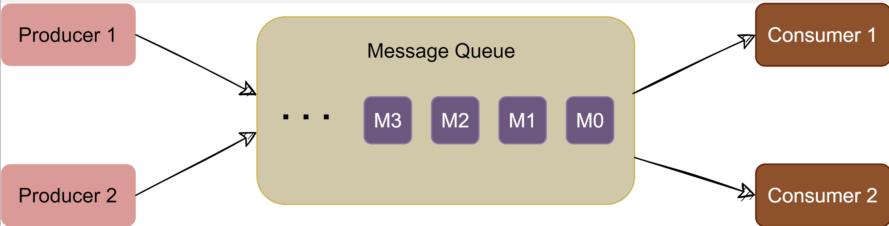
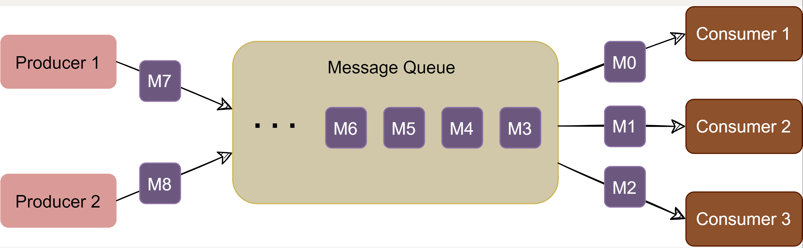
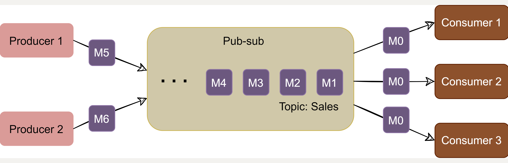
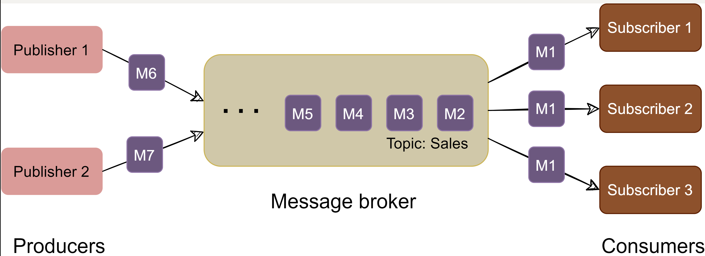

# Introduction to Messaging System

## Background
**One of the common challenges among distributed systems is handling a continuous influx of data from multiple sources**. Imagine a log aggregation service that is receiving hundreds of log entries per second from different sources. The function of this log aggregation service is to store these logs on disk at a shared server and also build an index so that the logs can be searched later. A few challenges of this service are:

- How will the log aggregation service handle a spike of messages? If the service can handle (or buffer) 500 messages per second, what will happen if it starts receiving a higher number of messages per second? If we decide to have multiple instances of the log aggregation service, how do we divide the work among these instances?
- How can we receive messages from different types of sources? The sources producing (or consuming) these logs need to decide upon a common protocol and data format to send log messages to the log aggregation service. This leads us to a strongly coupled architecture between the producer and consumer of the log messages.
- What will happen to the log messages if the log aggregation service is down or unresponsive for some time?

**To efficiently manage such scenarios, distributed systems depend upon a messaging system**.

## What is a messaging system?
A messaging system is **responsible for transferring data among services, applications, processes, or servers**. Such a system helps decouple different parts of a distributed system by providing an **asynchronous way of transferring messaging between the sender and the receiver**. Hence, all senders (or producers) and receivers (or consumers) focus on the data/message without worrying about the mechanism used to share the data.

  

There are two common ways to handle messages: Queuing and Publish-Subscribe.

## Queue
In the queuing model, messages are **stored sequentially in a queue**. **Producers push messages to the rear of the queue**, and **consumers extract the messages from the front of the queue**.

  

A **particular message can be consumed by a maximum of one consumer only**. Once a consumer grabs a message, it is removed from the queue such that the next consumer will get the next message. This is a great model for distributing message-processing among multiple consumers. But this also **limits the system as multiple consumers cannot read the same message from the queue**. 

  

## Publish-subscribe messaging system
In the pub-sub (short for publish-subscribe) model, **messages are divided into topics**. A publisher (or a producer) **sends a message to a topic that gets stored in the messaging system under that topic**. Subscribers (or the consumer) **subscribe to a topic to receive every message published to that topic**. Unlike the Queuing model, the pub-sub model **allows multiple consumers to get the same message**; **if two consumers subscribe to the same topic, they will receive all messages published to that topic**.

  

## Message Broker

The messaging system that stores and maintains the messages is commonly known as the **message broker**. It provides a loose coupling between publishers and subscribers, or producers and consumers of data.

  

The message broker stores published messages in a queue, and subscribers read them from the queue. Hence, subscribers and publishers do not have to be synchronized. This loose coupling enables subscribers and publishers to read and write messages at different rates.

The messaging system's ability to store messages **provides fault-tolerance, so messages do not get lost between the time they are produced and the time they are consumed**.

To summarize, a message system is deployed in an application stack for the following reasons:

1. Messaging buffering: To provide a **buffering mechanism in front of processing** (i.e., to deal with temporary incoming message spikes that are greater than what the processing app can deal with). This enables the system to **safely deal with spikes in workloads by temporarily storing data until it is ready for processing**.

2. Guarantee of message delivery: Allows producers to publish messages with **assurance that the message will eventually be delivered if the consuming application is unable to receive the message when it is published**.

3. Providing abstraction: Distributed messaging systems **enable decoupling of sender and receiver components in a system**, allowing them to **evolve independently**. This architectural pattern promotes modularity, making it easier to maintain and update individual components without affecting the entire system.

4. Scalability: Distributed messaging systems can handle a large number of messages and can scale horizontally to accommodate increasing workloads. This allows applications to grow and manage higher loads without significant performance degradation.

5. Fault Tolerance: By distributing messages across multiple nodes or servers, these systems can continue to operate even if a single node fails. This redundancy provides increased reliability and ensures that messages are not lost during system failures.

5. Asynchronous Communication: These systems **enable asynchronous communication between components**, allowing them to process messages at their own pace without waiting for immediate responses. This can improve overall system performance and responsiveness, particularly in scenarios with high latency or variable processing times.

6. Load Balancing: Distributed messaging systems can automatically distribute messages across multiple nodes, ensuring that no single node becomes a bottleneck. This allows for better resource utilization and improved overall performance.

7. Message Persistence: Many distributed messaging systems provide message persistence, ensuring that **messages are not lost if a receiver is temporarily unavailable or slow to process messages**. This feature helps maintain data consistency and reliability across the system.

8. Security: Distributed messaging systems often support various security mechanisms, such as encryption and authentication, to protect sensitive data and prevent unauthorized access.

9. Interoperability: These systems often support multiple messaging protocols and can integrate with various platforms and technologies, making it easier to connect different components within a complex system.