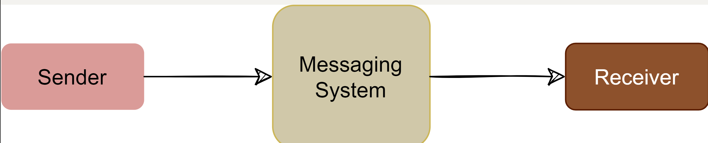

# Introduction to Messaging System

## Background
**One of the common challenges among distributed systems is handling a continuous influx of data from multiple sources**. Imagine a log aggregation service that is receiving hundreds of log entries per second from different sources. The function of this log aggregation service is to store these logs on disk at a shared server and also build an index so that the logs can be searched later. A few challenges of this service are:

- How will the log aggregation service handle a spike of messages? If the service can handle (or buffer) 500 messages per second, what will happen if it starts receiving a higher number of messages per second? If we decide to have multiple instances of the log aggregation service, how do we divide the work among these instances?
- How can we receive messages from different types of sources? The sources producing (or consuming) these logs need to decide upon a common protocol and data format to send log messages to the log aggregation service. This leads us to a strongly coupled architecture between the producer and consumer of the log messages.
- What will happen to the log messages if the log aggregation service is down or unresponsive for some time?

**To efficiently manage such scenarios, distributed systems depend upon a messaging system**.

## What is a messaging system?
A messaging system is **responsible for transferring data among services, applications, processes, or servers**. Such a system helps decouple different parts of a distributed system by providing an **asynchronous way of transferring messaging between the sender and the receiver**. Hence, all senders (or producers) and receivers (or consumers) focus on the data/message without worrying about the mechanism used to share the data.

  

There are two common ways to handle messages: Queuing and Publish-Subscribe.

## Queue
In the queuing model, messages are **stored sequentially in a queue**. **Producers push messages to the rear of the queue**, and **consumers extract the messages from the front of the queue**.

  

A **particular message can be consumed by a maximum of one consumer only**. Once a consumer grabs a message, it is removed from the queue such that the next consumer will get the next message. This is a great model for distributing message-processing among multiple consumers. But this also **limits the system as multiple consumers cannot read the same message from the queue**. 

  

## Publish-subscribe messaging system
In the pub-sub (short for publish-subscribe) model, **messages are divided into topics**. A publisher (or a producer) **sends a message to a topic that gets stored in the messaging system under that topic**. Subscribers (or the consumer) **subscribe to a topic to receive every message published to that topic**. Unlike the Queuing model, the pub-sub model **allows multiple consumers to get the same message**; **if two consumers subscribe to the same topic, they will receive all messages published to that topic**.

  

## Message Broker

The messaging system that stores and maintains the messages is commonly known as the **message broker**. It provides a loose coupling between publishers and subscribers, or producers and consumers of data.

  

The message broker stores published messages in a queue, and subscribers read them from the queue. Hence, subscribers and publishers do not have to be synchronized. This loose coupling enables subscribers and publishers to read and write messages at different rates.

The messaging system's ability to store messages **provides fault-tolerance, so messages do not get lost between the time they are produced and the time they are consumed**.

To summarize, a message system is deployed in an application stack for the following reasons:

1. Messaging buffering: To provide a **buffering mechanism in front of processing** (i.e., to deal with temporary incoming message spikes that are greater than what the processing app can deal with). This enables the system to **safely deal with spikes in workloads by temporarily storing data until it is ready for processing**.

2. Guarantee of message delivery: Allows producers to publish messages with **assurance that the message will eventually be delivered if the consuming application is unable to receive the message when it is published**.

3. Providing abstraction: Distributed messaging systems **enable decoupling of sender and receiver components in a system**, allowing them to **evolve independently**. This architectural pattern promotes modularity, making it easier to maintain and update individual components without affecting the entire system.

4. Scalability: Distributed messaging systems can handle a large number of messages and can scale horizontally to accommodate increasing workloads. This allows applications to grow and manage higher loads without significant performance degradation.

5. Fault Tolerance: By distributing messages across multiple nodes or servers, these systems can continue to operate even if a single node fails. This redundancy provides increased reliability and ensures that messages are not lost during system failures.

5. Asynchronous Communication: These systems **enable asynchronous communication between components**, allowing them to process messages at their own pace without waiting for immediate responses. This can improve overall system performance and responsiveness, particularly in scenarios with high latency or variable processing times.

6. Load Balancing: Distributed messaging systems can automatically distribute messages across multiple nodes, ensuring that no single node becomes a bottleneck. This allows for better resource utilization and improved overall performance.

7. Message Persistence: Many distributed messaging systems provide message persistence, ensuring that **messages are not lost if a receiver is temporarily unavailable or slow to process messages**. This feature helps maintain data consistency and reliability across the system.

8. Security: Distributed messaging systems often support various security mechanisms, such as encryption and authentication, to protect sensitive data and prevent unauthorized access.

9. Interoperability: These systems often support multiple messaging protocols and can integrate with various platforms and technologies, making it easier to connect different components within a complex system.

# What is Kafka?
Apache Kafka is an **open-source publish-subscribe-based messaging system**. It is distributed, durable, fault-tolerant, and highly scalable by design. Fundamentally, it is **a system that takes streams of messages from applications known as producers**, **stores them reliably on a central cluster** (containing a set of brokers), and **allows those messages to be received by applications** (known as consumers) that process the messages.

  

## Background
Kafka was created at LinkedIn around 2010 to track various events, such as page views, messages from the messaging system, and logs from various services. Later, it was made open-source and developed into a comprehensive system which is used for:

1. Reliably storing a huge amount of data.
2. Enabling high throughput of message transfer between different entities.
3. Streaming real-time data.

At a high level, we can call Kafka a **distributed Commit Log**. A Commit Log (also known as a Write-Ahead log or a Transactions log) is an **append-only data structure that can persistently store a sequence of records**. Records are always appended to the end of the log, and once added, **records cannot be deleted or modified**. Reading from a commit log always happens from left to right (or old to new).

Kafka stores all of its messages on disk. Since all reads and writes happen in sequence, Kafka takes advantage of sequential disk reads (more on this later).

  

## Kafka use cases
Kafka can be used for collecting big data and real-time analysis. Here are some of its top use cases:

1. Metrics: Kafka can be used to collect and aggregate monitoring data. Distributed services can push different operational metrics to Kafka servers. These metrics can then be pulled from Kafka to produce aggregated statistics.
2. Log Aggregation: Kafka can be used to collect logs from multiple sources and make them available in a standard format to multiple consumers.
3. Stream processing: Kafka is quite useful for use cases where the collected data undergoes processing at multiple stages. For example, the raw data consumed from a topic is transformed, enriched, or aggregated and pushed to a new topic for further consumption. This way of data processing is known as stream processing.
4. Commit Log: Kafka can be used as an external commit log for any distributed system. Distributed services can log their transactions to Kafka to keep track of what is happening. This transaction data can be used for replication between nodes and also becomes very useful for disaster recovery, for example, to help failed nodes to recover their states.
5. Website activity tracking: One of Kafka's original use cases was to build a user activity tracking pipeline. User activities like page clicks, searches, etc., are published to Kafka into separate topics. These topics are available for subscription for a range of use cases, including real-time processing, real-time monitoring, or loading into Hadoop or data warehousing systems for offline processing and reporting.
6. Product suggestions: Imagine an online shopping site like amazon.com, which offers a feature of 'similar products' to suggest lookalike products that a customer could be interested in buying. To make this work, we can track every consumer action, like search queries, product clicks, time spent on any product, etc., and record these activities in Kafka. Then, a consumer application can read these messages to find correlated products that can be shown to the customer in real-time. Alternatively, since all data is persistent in Kafka, a batch job can run overnight on the 'similar product' information gathered by the system, generating an email for the customer with product suggestions.

## Kafka common terms

Before digging deep into Kafka's architecture, let's first go through some of its common terms.

### Brokers
A **Kafka server is also called a broker**. Brokers are **responsible for reliably storing data provided by the producers and making it available to the consumers**.

### Records
A record is **a message or an event that gets stored in Kafka**. Essentially, it is the data that travels from producer to consumer through Kafka. A record contains a *key*, a *value*, a *timestamp*, and *optional metadata headers*.

  

### Topics
Kafka **divides its messages into categories called Topics**. In simple terms, a **topic is like a table in a database**, and the **messages are the rows in that table**.

- Each message that Kafka receives from a *producer* is **associated with a topic**.
- Consumers can **subscribe to a topic** to get *notified* when new messages are added to that topic.
- A **topic can have multiple subscribers** that read messages from it.
- In a Kafka cluster, a **topic is identified by its name and must be unique**.

**Messages in a topic can be read as often as needed** — unlike traditional messaging systems, **messages are not deleted after consumption**. Instead, **Kafka retains messages for a configurable amount of time** or **until a storage size is exceeded**. Kafka's performance is effectively constant with respect to data size, so storing data for a long time is perfectly fine.

  

### Producers
Producers are **applications** that **publish (or write) records to Kafka**.

### Consumers
Consumers are the **applications** that **subscribe to (read and process) data from Kafka topics**. Consumers **subscribe to one or more topics and consume published messages by pulling data from the brokers**.

In Kafka, **producers and consumers are fully decoupled** and agnostic of each other, which is a key design element to achieve the high scalability that Kafka is known for. For example, **producers never need to wait for consumers**.

### High-level architecture
At a high level, applications (producers) send messages to a Kafka broker, and these messages are read by other applications called consumers. Messages get stored in a topic, and consumers subscribe to the topic to receive new messages.

### Kafka cluster
Kafka is deployed as a cluster of one or more servers, where each server is responsible for running one Kafka broker.

### ZooKeeper
ZooKeeper is a **distributed key-value store** and is used for **coordination and storing configurations**. It is highly optimized for reads. **Kafka uses ZooKeeper to coordinate between Kafka brokers**; ZooKeeper **maintains metadata information about the Kafka cluster**. We will be looking into this in detail later.

  

# Messaging patterns
In the realm of distributed systems, effective communication between various components is crucial for achieving seamless integration and efficient data flow. Messaging patterns play a vital role in enabling this communication by defining standardized approaches to exchanging information between components. These patterns address various scenarios and requirements, such as ensuring message delivery, broadcasting information, and enabling synchronous or asynchronous communication. By understanding and applying these messaging patterns, developers can create robust, scalable, and maintainable distributed systems capable of meeting diverse business needs.

Here are some of the **most common messaging patterns**, their **use cases**, and **real-life examples** to help illustrate their significance and implementation in distributed systems.

## 1. Point-to-Point (Direct Messaging):
In point-to-point messaging, **messages are sent from a single producer to a single consumer**. Queues are often used to implement this pattern, ensuring that messages are delivered in a **first-in-first-out (FIFO) order**. Point-to-point messaging is well-suited for applications where **each message must be processed by a single consumer**. Key characteristics of point-to-point messaging include:

- Simplicity: This pattern is straightforward, making it easy to understand and implement.
- Direct communication: Messages are sent directly between the producer and the consumer, without intermediaries.
- Limited scalability: Point-to-point messaging may not scale well for large systems with many producers and consumers.
- Example: An order processing system where an order is placed by a customer (producer), and a single consumer (provider) processes the order. The order messages are stored in a queue, and each consumer picks up one order at a time for processing.

## 2. Publish-Subscribe (Pub/Sub):
In the publish-subscribe pattern, **messages are sent from a producer (publisher) to multiple consumers (subscribers)**. The messages are **sent to a topic**, and all **subscribers that have expressed interest in that topic receive the messages**. This pattern is ideal for applications requiring the dissemination of information to multiple recipients or when the sender doesn't need to know who the recipients are. Key characteristics of publish-subscribe messaging include:

- Decoupling: Producers and consumers are decoupled, improving modularity and flexibility.
- Scalability: The pattern can scale to handle many producers and consumers.
- Dynamic subscriptions: Consumers can dynamically subscribe and unsubscribe from message topics.
- Example: A stock market ticker application where stock price updates are sent to a topic. Multiple subscribers, such as trading applications, financial news services, or individual investors, receive these updates in real time.

## 3. Request-Reply (Request-Response):
In the request-reply pattern, a **producer (requester) sends a message to a consumer (responder)** and waits for a response. This pattern is often used for **synchronous communication** between two parties, where the sender **requires a response** before continuing its operation.

**Example**: An e-commerce application where a user submits a payment request. The payment gateway processes the request and sends back a response indicating whether the payment was successful or not. The e-commerce application waits for the response before proceeding with the order confirmation. Key characteristics of request-reply messaging include:

- Synchronous communication: This pattern is often used for **synchronous communication between components**, where the consumer waits for the reply before proceeding.
- Coupling: The pattern can introduce tighter coupling between producers and consumers since the consumer must wait for a reply.
- Latency: Request-reply messaging can introduce latency as the consumer must wait for the reply to arrive.

## 4. Fan-Out/Fan-In (Scatter-Gather):
In the fan-out/fan-in pattern, a message is **sent to multiple consumers** (fan-out), and the responses from these **consumers are aggregated before being sent back to the original sender** (fan-in). **This pattern is useful when a task needs to be distributed across multiple workers, and the results must be collected and combined**. Key characteristics of fan-out / fan-in messaging include:

- Parallelism: The pattern enables parallel processing, improving throughput and performance.
- Load balancing: The pattern can be used to distribute workload evenly among consumers.
- Aggregation: The fan-in phase allows for aggregation of processed messages, enabling further processing or analysis.

**Example**: A search engine that sends a search query to multiple index servers. Each server returns relevant results, which are then combined and ranked before being sent back to the user as a single, unified set of search results.

## 5. Dead Letter Queue (DLQ):
The dead letter queue pattern is **used to handle erroneous or invalid messages that cannot be processed by consumers**. **These messages are sent to a dedicated queue called the dead letter queue**, where they can be monitored, analyzed, or reprocessed. This pattern helps to **ensure that problematic messages do not block the processing of other messages in the system**. Key characteristics of Dead Letter Queue messaging include:

- Error handling: Unprocessable messages are redirected to the DLQ, **preventing them from blocking the primary message queue**.
- Monitoring and debugging: DLQs can be monitored to **detect issues with message processing** and help identify the root cause of problems.
- Retention: Messages in the DLQ can be retained for a specific period, allowing for the possibility of retries or manual intervention.
- Fault isolation: DLQs help isolate problematic messages, reducing the impact of errors on the rest of the system.

**Example**: An email delivery system where messages that fail to be delivered (due to invalid addresses, full mailboxes, etc.) are sent to a dead letter queue. Administrators can then inspect the messages, fix any issues, and attempt to redeliver them.

# Popular Messaging Queue Systems
In this section, we will discuss some popular messaging queue systems and provide a brief overview of their key features and use cases. The following messaging queue systems have gained popularity due to their *robustness*, *scalability*, and *performance*:

## a. RabbitMQ
RabbitMQ is an **open-source message broker** that provides support for various messaging patterns, including **publish-subscribe, request-reply, and point-to-point communication**. Key features of RabbitMQ include:

- Flexibility: RabbitMQ supports various messaging patterns and protocols.
- Clustering and high availability: RabbitMQ **can be deployed in clustered configurations for fault tolerance and load balancing**.
- Extensibility: RabbitMQ provides a plugin system to extend its functionality, such as adding support for additional protocols.
- Monitoring and management: RabbitMQ includes **built-in tools for monitoring and managing the message broker**.

## b. Apache Kafka
Apache Kafka is a **distributed streaming platform designed for high-throughput**, **fault-tolerant**, and **scalable messaging**. Kafka is widely used for **stream processing, log aggregation, and event-driven architectures**. Key features of Apache Kafka include:

- Distributed architecture: Kafka scales horizontally, allowing it to handle high-throughput and provide fault tolerance.
- Durability: Kafka stores messages persistently on disk, ensuring data durability and allowing for message replay.
- Low latency: Kafka is designed for real-time processing and provides low-latency messaging.
- Stream processing: Kafka includes a stream processing API for building real-time data processing applications.

## c. Amazon Simple Queue Service (SQS)
Amazon SQS is a **fully managed message queuing service provided by Amazon Web Services** (AWS). It enables decoupling of components in a distributed system, ensuring reliable and scalable communication. Key features of Amazon SQS include:

- Scalability: SQS automatically scales with the number of messages and the number of consumers.
- Reliability: SQS **guarantees at-least-once message delivery** and provides visibility timeouts for message processing.
- Security: SQS integrates with AWS Identity and Access Management (IAM) to control access to queues and messages.
- Cost-effective: SQS operates on a pay-as-you-go pricing model, making it cost-effective for various workloads.

## d. Apache ActiveMQ
Apache ActiveMQ is **an open-source, multi-protocol message broker** that supports a variety of messaging patterns. Key features of Apache ActiveMQ include:

- High availability: ActiveMQ provides support for primary-replica replication and network of brokers for increased availability and load balancing.
- Message persistence: ActiveMQ supports various persistence options, such as file-based, in-memory, and JDBC-based storage.
- Integration: ActiveMQ can be easily integrated with various platforms, such as Java EE and Spring.

## Summary Comparison:
- RabbitMQ: Best for traditional message queueing tasks, task distribution, and real-time messaging.
- Apache Kafka: Ideal for high-throughput, **real-time data streaming**, log aggregation, and event sourcing.
- Amazon SQS: Suitable for cloud-native, decoupling microservices, buffering requests, and **serverless architectures**.
- Apache ActiveMQ: Fits well with enterprise integration, legacy system integration, and high availability messaging needs.

## Message Queue Systems Use Cases

| Use Case                        | RabbitMQ                                              | Apache Kafka                                         | Amazon SQS                                         | Apache ActiveMQ                                    |
|---------------------------------|-------------------------------------------------------|------------------------------------------------------|----------------------------------------------------|----------------------------------------------------|
| **Task Queueing**               | Distribute tasks among workers                        | -                                                    | Distribute tasks among workers                      | Distribute tasks among workers                      |
| **Request/Reply**               | Synchronous communication between services            | -                                                    | -                                                  | Synchronous communication between services          |
| **Pub/Sub**                     | Real-time messaging, live notifications               | Real-time data streaming, broadcasting events        | -                                                  | Decoupling message producers from consumers         |
| **IoT Applications**            | Manage and route messages from devices                | -                                                    | -                                                  | Manage and route messages from devices              |
| **Order Processing Systems**    | Ensure correct sequence processing of orders          | -                                                    | -                                                  | Ensure correct sequence processing of orders        |
| **Real-Time Data Streaming**    | -                                                     | High-volume data collection and processing           | -                                                  | -                                                  |
| **Event Sourcing**              | -                                                     | Store sequence of events                             | -                                                  | -                                                  |
| **Log Aggregation**             | -                                                     | Centralize and analyze logs                          | -                                                  | -                                                  |
| **Metrics Collection**          | -                                                     | Aggregate and analyze system metrics                 | -                                                  | -                                                  |
| **ETL Pipelines**               | -                                                     | Ingest, transform, and load data                     | -                                                  | -                                                  |
| **Real-Time Analytics**         | -                                                     | Real-time data processing for analytics              | -                                                  | -                                                  |
| **Decoupling Microservices**    | -                                                     | -                                                    | Allow asynchronous communication between services  | Allow asynchronous communication between services  |
| **Buffering Requests**          | -                                                     | -                                                    | Handle bursty traffic                               | -                                                  |
| **Serverless Architectures**    | -                                                     | -                                                    | Integrate with AWS Lambda                           | -                                                  |
| **Message Durability**          | -                                                     | -                                                    | Ensure messages are not lost                        | Ensure messages are not lost                        |
| **Enterprise Integration**      | -                                                     | -                                                    | -                                                  | Implement enterprise integration patterns           |
| **Legacy System Integration**   | -                                                     | -                                                    | -                                                  | Integrate legacy systems                            |
| **High Availability Messaging** | -                                                     | -                                                    | -                                                  | Ensure high availability and fault tolerance        |
| **Transactional Messaging**     | -                                                     | -                                                    | -                                                  | Support transactional messaging                     |
| **Distributed Systems**         | -                                                     | -                                                    | -                                                  | Facilitate communication between distributed components |
