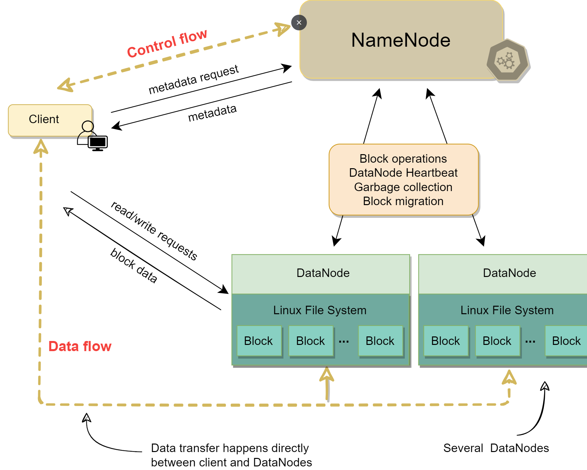

# What is a Distributed File System?
Distributed File Systems are a **type of file system that manage the storage and retrieval of data across multiple servers and locations**, making the distributed nature of the storage transparent to the user. These systems are designed to provide reliable, efficient access to files over a network, typically in a large-scale environment.

## Key Characteristics

### Data Distribution
- Files are **stored across multiple physical servers**, which may be spread across different geographic locations. This distribution enhances data availability and reliability.

### Transparency
- The complexity of the underlying distributed architecture is abstracted away from the user. Users interact with the system as if it were a local file system.

### Scalability
- They can handle large amounts of data and a large number of users or clients. The system **can be scaled by adding more servers**.

### Fault Tolerance
- Most distributed file systems are **designed to handle failures gracefully**. Data is **often replicated across multiple nodes** to **ensure availability and durability**.

### Consistency
- Ensures that file updates are propagated across the system, maintaining consistency. Some systems provide strong consistency while others offer eventual consistency.

## Common Use Cases
1. Cloud Storage Services: Services like Google Drive, Dropbox, and others use distributed file systems to store user files across many servers.

2. Big Data Applications: Systems like Hadoop Distributed File System (HDFS) are specifically designed for storing and processing large datasets.

3. Content Delivery Networks: Distributing content across different regions to improve access speed and reliability.

4. High-Performance Computing: Where large datasets need to be accessed and processed concurrently by multiple systems.

## Examples of Distributed File Systems
1. Hadoop Distributed File System (HDFS): Designed to store large data sets reliably and stream them at high bandwidth to user applications.

2. Google File System (GFS): Optimized for Google's own large-scale data processing needs.

3. Microsoft Distributed File System (DFS): Used in Windows Server environments, allowing files distributed across multiple servers to appear as if they are in one place.

4. Amazon Elastic File System (EFS): A cloud-based file storage service for use with Amazon EC2.

5. Ceph File System (CephFS): A POSIX-compliant file system that uses the Ceph storage architecture to store data across a network.

## Challenges
- Data Synchronization: Keeping data synchronized across multiple nodes is challenging, especially under heavy load or in the event of network partitions.
- Security: Ensuring data security across a distributed network can be complex.
- Performance: Network latency can impact performance, especially when compared to local file systems.

## Conclusion
Distributed File Systems are crucial for modern computing environments where large-scale data storage, high availability, and remote access are required. They provide an effective solution for managing data across multiple locations but come with challenges that need careful management, especially regarding synchronization, security, and performance.

# Architecture of a Distributed File System
The internal architecture of a distributed file system (DFS) is **designed to manage data across a network of machines efficiently**. While the specific architecture can vary depending on the particular DFS, there are common components and principles that many distributed file systems share.

## Key Components of a Distributed File System
1. Client Interface
- Function: Provides a way for clients (users or applications) to access and manipulate files as if they were on a local file system.
- Implementation: Typically includes a set of APIs or command-line tools that interact with the DFS.

2. Metadata Servers
- Function: Manage metadata about files, such as location information, directory structures, permissions, and file attributes.
- Characteristics: Often, metadata is separated from actual file data for efficiency. Metadata servers can be a single point of failure, so they are often replicated for reliability.

3. Data Nodes or Storage Nodes
- Function: Store the actual file data.
- Characteristics: Data is often distributed across multiple nodes for redundancy and availability. These nodes handle read/write operations as instructed by the control plane (metadata servers).

4. Replication and Redundancy Mechanism
- Function: Ensures data availability and durability by replicating files across multiple nodes.
- Characteristics: The system can automatically replicate data to handle node failures and ensure data integrity.

5. Load Balancer or Scheduler
- Function: Distributes workload evenly across different nodes and manages resource allocation.
-Characteristics: Essential for optimizing performance and preventing any single node from becoming a bottleneck.

6. Network Infrastructure
- Function: Connects all components of the DFS and facilitates communication between them.
- Characteristics: Reliability and speed of the network are crucial for the performance of a DFS.

7. Synchronization and Consistency Mechanisms
- Function: Ensures that all copies of a file are kept consistent across the system.
- Characteristics: Different systems use various models of consistency (strong, eventual, etc.) and synchronization techniques.

8. Fault Tolerance and Recovery Mechanisms
- Function: Handles failures of nodes or network components without data loss or significant downtime.
- Characteristics: Includes mechanisms for detecting failures, re-routing requests, and restoring data from backups or replicas.

9. Security Features
- Function: Protects data from unauthorized access and ensures secure communication across the network.
- Characteristics: May include encryption, access control lists, authentication mechanisms, and secure protocols.

## Example: Hadoop Distributed File System (HDFS)
To illustrate, let's consider HDFS, a commonly used DFS:

- Client Interface: HDFS provides interfaces for clients to interact with the file system.
- NameNode: The central metadata server in HDFS, storing the file system tree and metadata for all files and directories.
- DataNodes: Store actual data in HDFS. Each file is divided into blocks, and each block is stored on multiple DataNodes.
- Replication: HDFS replicates each data block across multiple DataNodes to ensure fault tolerance.
- YARN (Yet Another Resource Negotiator): Responsible for managing resources in the Hadoop cluster and scheduling tasks.

  

## Conclusion
The architecture of a distributed file system is complex and involves multiple components working together to manage, store, and retrieve data efficiently across a network. This architecture allows DFS to provide high availability, scalability, and reliability, making it suitable for storing and processing large amounts of data in distributed computing environments.

# Key Components of a DFS
In a Distributed File System (DFS), replication, scalability, and consistency are key components that ensure the system's reliability, performance, and integrity. Let's delve into how each of these aspects is typically handled:

## 1. Replication
### Purpose
- Replication in DFS is primarily about ensuring data availability and durability. By **creating multiple copies of data across different nodes**, DFS protects against data loss due to node failures.

### Implementation
- Data Blocks: Files are often divided into blocks, and each block is replicated across multiple nodes.
- Replication Factor: DFS usually allows configuring the replication factor, i.e., the number of replicas for each block.
- Placement Strategy: Intelligent placement of replicas across different nodes or racks to ensure high availability and fault tolerance.

### Challenges
- Network Bandwidth: Replication consumes network bandwidth, especially during the initial copying of data.
- Storage Overhead: Requires additional storage capacity for replicas.

## 2. Scalability

### Purpose
- Scalability ensures that the DFS can grow in capacity and performance as the amount of data or the number of users increases.

### Implementation
- Horizontal Scaling: DFS scales out by **adding more nodes to the system**. This can be done without disrupting the service.
- Load Distribution: Distributes file blocks evenly across all nodes to balance the load.
- Decentralized Design: **Avoids single points of failure and bottlenecks**, allowing for seamless scaling.

### Challenges
- Metadata Management: Scaling up involves efficiently managing metadata so that it doesn't become a bottleneck.
- Balancing the Load: Ensuring new nodes are effectively utilized and the load is evenly distributed.

## 3. Consistency
### Purpose
- Consistency in DFS is about **ensuring that all clients see the same data at any given time**, despite data replication and concurrent modifications.

### Implementation
- Consistency Models: Different DFS implementations use different consistency models, from strict consistency (where all nodes see the data at the same time) to eventual consistency (where data updates will eventually propagate to all nodes but are not immediately visible).
- Versioning and Timestamps: Used to manage updates to replicated data.
- Locking and Synchronization Mechanisms: Ensuring that write operations are properly synchronized across replicas.

### Challenges
- Trade-off with Performance: Strong consistency can impact system performance and latency.
- Handling Concurrency: Ensuring data integrity in the presence of concurrent accesses and updates.

## Conclusion
In a DFS, replication ensures data is not lost and is accessible even under failures, scalability allows the system to grow and accommodate more data and users, and consistency ensures that all users have a coherent view of the data. The specific implementation details can vary among different DFS solutions, and there are often trade-offs to consider. For instance, achieving higher levels of consistency might impact performance, and ensuring effective replication and scalability requires careful architectural planning and resource management.